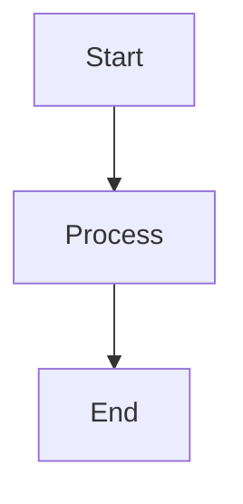

You are tasked with updating the Voltaire Mintlify documentation. Follow these patterns and structures precisely.

## CRITICAL CONTEXT

**Architecture**: Dual API (Class + Branded Types), multi-language (TS/Zig/Rust/C), tree-shakeable, WASM-accelerated
**Docs Framework**: Mintlify (MDX), docs.json navigation (legacy: mint.json), centralized docs
**Communication**: Brief, concise, evidence-based. No fluff.
**AI Optimization**: Docs optimized for both human and LLM readers (llms.txt, Model Context Protocol)

**Documentation Style Inspiration**: Write in the style of world-class documentation sites:
- **Vue.js docs** - Clear progressive examples, scannable structure, excellent use of code tabs
- **Stripe docs** - Precise API reference, real-world examples, clean visual hierarchy
- **Ethereum specs** - Technical precision, specification references, formal definitions
- **MDN Web Docs** - Comprehensive coverage, browser compatibility tables, interactive examples

**Core Principles**:
- **Clarity over cleverness** - Simple, direct language
- **Examples before theory** - Show working code immediately
- **Visual hierarchy** - Use headings, lists, cards, tabs to make content scannable
- **Progressive disclosure** - Start simple, layer complexity gradually
- **Zero ambiguity** - Precise technical language, link to specifications

---

## KEY FILES

**Core Pages**:
- **Home page**: `docs/index.mdx` (landing page with hero, features, `mode: custom`)
- **Introduction**: `docs/introduction.mdx` (why Voltaire, key differentiators, examples)
- **Getting Started**: `docs/getting-started.mdx` (installation, setup, first steps)
- **MCP Integration**: `docs/mcp.mdx` (Model Context Protocol integration)

**Configuration**:
- **Navigation**: `docs/mint.json` (site-wide navigation, theme, colors, settings)
  - Alternative: `docs/docs.json` (modern format, may be symlink to mint.json)
  - Contains full navigation structure for all 316+ pages

**Concepts** (foundational patterns):
- `docs/concepts/branded-types.mdx` (branded type pattern explanation)
- `docs/concepts/data-first.mdx` (data-first design philosophy)
- `docs/concepts/api-patterns.mdx` (dual API: Class vs Namespace)

**Content Structure**:
- **Primitives**: `docs/primitives/{name}/` (23 modules: Address, Bytecode, Abi, etc.)
  - Each has `index.mdx` (overview) + method-specific pages
- **Cryptography**: `docs/crypto/{algorithm}/` (17 modules: Keccak256, Secp256k1, etc.)
- **EVM**: `docs/evm/` (instructions, precompiles)
- **JSON-RPC**: `docs/jsonrpc/` (provider functionality)

**Meta Documentation**:
- `docs/CLAUDE.md` (documentation authoring guidelines for Claude)
- `.claude/commands/docs.md` (this file - slash command context)

---

## DOCUMENTATION STRUCTURE

### Directory Layout

```
docs/                           # All documentation (Mintlify)
├── introduction.mdx           # Main intro
├── getting-started.mdx        # Setup guide
├── concepts/
│   ├── branded-types.mdx      # Branded type pattern explanation
│   └── data-first.mdx         # Data-first design pattern
├── primitives/
│   ├── address/               # All primitives in docs/
│   │   ├── overview.mdx       # Main overview
│   │   ├── branded-address.mdx
│   │   ├── constructors.mdx
│   │   ├── conversions.mdx
│   │   ├── validation.mdx
│   │   ├── comparisons.mdx
│   │   ├── contract-addresses.mdx
│   │   ├── uint8array-methods.mdx
│   │   ├── variants.mdx
│   │   └── wasm.mdx
│   ├── bytecode/
│   ├── abi/
│   └── ...                    # All 23 primitives
├── crypto/
│   ├── keccak256.mdx
│   ├── secp256k1.mdx
│   ├── bls12-381.mdx
│   ├── bn254.mdx
│   └── kzg.mdx
├── precompiles/
│   ├── ecrecover.mdx
│   ├── sha256.mdx
│   └── bls12-381.mdx
└── docs.json                  # Global site settings

src/                           # Source code (no docs)
├── primitives/
│   ├── Address/
│   │   ├── BrandedAddress.ts
│   │   ├── Address.ts
│   │   └── *.test.ts
│   └── ...
└── crypto/
```

**All documentation is centralized in `docs/`**. No colocated docs, no symlinks.

### Configuration Files

- **docs.json** - Global site configuration (navigation, theme, metadata, integrations)
  - Modern format with recursive navigation structure
  - Tabs, groups, and pages unified in single hierarchy
  - More flexible than legacy mint.json format
- **mint.json** - Legacy name (deprecated but still supported for backwards compatibility)
  - Voltaire uses docs.json (mint.json is symlink/alias)
  - New projects should use docs.json

---

## FRONTMATTER REFERENCE

Every MDX file MUST have frontmatter. Frontmatter is YAML between `---` separators at the start of the file.

### Required Fields

```yaml
---
title: Page Title
description: One-line description for SEO and social previews
---
```

### All Available Fields

```yaml
---
# Required
title: string                    # Page title (displayed at top, browser tab, metadata)
description: string              # SEO description (search engines, social previews)

# Optional - Display & Navigation
sidebarTitle: string             # Override title in sidebar navigation
icon: string                     # Icon name (Font Awesome, Lucide, URL, or path)
                                 # Font Awesome: "code", "book", "rocket", "shield-check"
                                 # Lucide: any lucide icon name
                                 # URL: https://example.com/icon.svg
                                 # Path: /images/icon.svg
iconType: string                 # Font Awesome style: "regular" | "solid" | "light" |
                                 # "thin" | "sharp-solid" | "duotone" | "brands"
tag: string                      # Badge displayed next to title in navigation

# Optional - Page Layout (mode)
mode: "default" | "wide" | "custom" | "frame" | "center"
# - default: Standard layout with sidebar and TOC
# - wide: Removes TOC for wider content area
# - custom: Removes everything except top navbar (landing pages)
# - frame: Custom layout with sidebar (Aspen/Almond themes only)
# - center: Centers content, hides sidebar (Mint/Linden themes only)

# Optional - SEO & Discovery
noindex: boolean                 # Exclude from search engines (default: false)
keywords: string[]               # Search keywords (not visible on page)

# Optional - API Integration
openapi: string                  # Path to OpenAPI spec for API playground
                                 # Example: "GET /api/users" or "openapi.yaml#/paths/~1users/get"

# Optional - External Links
url: string                      # Redirect to external URL instead of rendering page

# Optional - Content Display
hideTitle: boolean               # Hide page title (default: false)
---
```

### Frontmatter Examples

**Simple page**:
```yaml
---
title: Bytecode Analysis
description: Analyze EVM bytecode for jump destinations and instructions
---
```

**Page with icon and sidebar title**:
```yaml
---
title: Advanced Patterns
description: Complex usage patterns for power users
sidebarTitle: Advanced
icon: rocket
tag: guide
---
```

**API reference page**:
```yaml
---
title: Bytecode.analyze
description: Parse bytecode instructions and find jump destinations
icon: code
openapi: GET /api/bytecode/analyze
---
```

**Concept explanation**:
```yaml
---
title: Branded Types
description: Zero-cost type safety with branded Uint8Arrays
sidebarTitle: Branded Types
icon: shield
tag: concept
---
```

---

## MARKDOWN AUTHORING

Mintlify supports full Markdown and MDX syntax. Use Markdown for structure, MDX for interactive components.

### Inline Styles

```markdown
Text can be **bold**, *italic*, or ~~strikethrough~~.

You can [link to another page](/getting-started/).

You can highlight `inline code` with backticks.
```

### Headings

```markdown
## Level 2 heading
### Level 3 heading
#### Level 4 heading
```

**Heading Guidelines**:
- H1 (`#`) is auto-generated from frontmatter `title` - do NOT manually add H1
- Start page content with H2 (`##`)
- Headings automatically get anchor links (e.g., `#level-2-heading`)
- H2 and H3 appear in table of contents by default
- Use descriptive headings for easy scanning

### Lists

**Unordered**:
```markdown
- Item one
- Item two
  - Nested item
  - Another nested item
- Item three
```

**Ordered**:
```markdown
1. First step
2. Second step
   1. Sub-step
   2. Another sub-step
3. Third step
```

**Task lists**:
```markdown
- [x] Completed task
- [ ] Incomplete task
- [ ] Another task
```

### Links

**Internal links** (to other pages):
```markdown
[Getting Started](/getting-started)
[Address constructors](/primitives/address/constructors)
[Specific section](/primitives/bytecode/analyze#usage)
```

**Important**: Mintlify links use absolute paths WITHOUT file extensions or trailing slashes.

**External links**:
```markdown
[Ethereum Yellow Paper](https://ethereum.github.io/yellowpaper/paper.pdf)
[EIP-55](https://eips.ethereum.org/EIPS/eip-55)
```

**Link to source code**:
```markdown
Defined in: [BrandedBytecode/analyze.js:22](https://github.com/evmts/voltaire/blob/main/src/primitives/Bytecode/BrandedBytecode/analyze.js#L22)
```

### Images

**Relative images** (stored in repo):
```markdown

```

**External images**:
```markdown

```

Images are automatically optimized by Astro.

### Code Blocks

Code blocks support syntax highlighting via Shiki for all major languages.

**Basic syntax**:
````markdown
```typescript
const address = Address.from("0x742d35Cc6634C0532925a3b844Bc9e7595f51e3e");
```
````

**Meta options** (flexible quoting: `""`, `''`, or unquoted strings; expressions use `{}`):
````markdown
```typescript title="example.ts" showLineNumbers
const address = Address.from("0x742d35Cc6634C0532925a3b844Bc9e7595f51e3e");
```
````

**Available meta options**:
- `title="string"` or `title='string'` - Display title/filename
- `icon="name"` - Add icon next to title
- `showLineNumbers` or `showLineNumbers={true}` - Show line numbers
- `{2-4}` - Highlight lines 2-4
- `"text"` - Highlight specific text
- `/regex/` - Highlight regex matches
- `wrap` - Enable text wrapping for long lines
- `collapsible` - Make code block expandable for long code
- `frame="none"` - Remove window frame (useful for terminal output)

**TypeScript with twoslash** (hover type info):
````markdown
```typescript twoslash
const address = Address.from("0x742d35Cc6634C0532925a3b844Bc9e7595f51e3e");
//    ^? (hover shows type)
```
````

**Diff visualization**:
````markdown
```typescript ins="newFunction()" del="oldFunction()"
// Shows additions in green, deletions in red
oldFunction();
newFunction();
```
````

**Alternative diff syntax**:
````markdown
```diff lang="typescript"
  function demo() {
-   console.log('Removed')
+   console.log('Added')
  }
```
````

**Custom themes**: Configure in `docs.json` or use CSS variables:
```json
{
  "codeBlock": {
    "theme": "github-dark"
  }
}
```

### Blockquotes

```markdown
> This is a blockquote.
>
> Commonly used for quoting specs or other sources.
```

### Tables

```markdown
| Method | Description | Returns |
|--------|-------------|---------|
| `from()` | Create from input | `Bytecode` |
| `toHex()` | Convert to hex | `Hex` |
| `equals()` | Compare bytecode | `boolean` |
```

**Alignment**:
```markdown
| Left | Center | Right |
|:-----|:------:|------:|
| L    | C      | R     |
```

### Horizontal Rules

```markdown
---
```

Use sparingly to separate major sections.

### HTML in Markdown

You can use HTML directly in Markdown:

```markdown
<details>
<summary>Click to expand</summary>

Hidden content here. Markdown **still works** inside HTML.

</details>
```

### Escaping Characters

Use backslash to escape special characters:

```markdown
\*Not italic\*
\`Not code\`
\[Not a link\]
```

---

## MINTLIFY COMPONENTS

Mintlify components are global - no imports needed. Components use JSX syntax within MDX files.

**Key Rules**:
- No imports required - all components are globally available
- Use JSX syntax: `<Component prop="value">content</Component>`
- Self-closing tags when no children: `<Component prop="value" />`
- Props can be strings, booleans, or expressions in curly braces `{}`
- Markdown content works inside component children

### Tabs Component

Group related code examples. Use for showing Class vs Namespace API or different languages.

**Basic tabs**:
```mdx
<Tabs>
  <Tab title="npm">
  ```bash
  npm install
  ```
  </Tab>
  <Tab title="pnpm">
  ```bash
  pnpm install
  ```
  </Tab>
  <Tab title="yarn">
  ```bash
  yarn install
  ```
  </Tab>
</Tabs>
```

**API style tabs** (common pattern):
```mdx
<Tabs>
  <Tab title="Class API">
  ```typescript
  const code = new Bytecode("0x6001");
  const hex = code.toHex();
  ```
  </Tab>
  <Tab title="Namespace API">
  ```typescript
  import * as Bytecode from '@tevm/voltaire/Bytecode';
  const code = Bytecode.from("0x6001");
  const hex = Bytecode.toHex(code);
  ```
  </Tab>
</Tabs>
```

**Props**:
- `title: string` (required) - Tab label text (keep short for better navigation)
- `icon: string` (optional) - Font Awesome, Lucide icon, URL, or path
- `iconType: string` (optional) - Font Awesome style (regular, solid, light, thin, sharp-solid, duotone, brands)

**Important**: Mintlify tabs do NOT synchronize across the page (each tab group is independent).

**Snippets** (reusable components):
```mdx
<Snippet file="shared-content.mdx" />
```
- Store in `snippets/` directory
- Supports variables and parameters
- Use for content repeated across multiple pages

---

### Callout Components

Highlight important information. Seven pre-styled callout types plus custom callouts.

**Pre-styled Callouts**:

```mdx
<Note>
General information and context.
</Note>

<Tip>
Helpful tips and best practices.
</Tip>

<Info>
Important information that needs attention.
</Info>

<Warning>
Caution about potential issues or gotchas.
</Warning>

<Danger>
Critical warnings about dangerous operations.
</Danger>

<Check>
Confirmation or success messages.
</Check>
```

**Custom Callout**:
```mdx
<Callout icon="rocket" iconType="solid" color="#FF6B6B">
Create fully customized callouts with your own icon and color.
</Callout>
```

**Props** (all callouts):
- `title: string` (optional) - Custom title text
- `icon: string` (optional, Callout only) - Font Awesome, Lucide, URL, or path
- `iconType: string` (optional) - Font Awesome style
- `color: string` (optional, Callout only) - Icon color in hex format

---

### Card & CardGroup Components

Visual containers for navigation and content organization.

**Basic Card**:
```mdx
<Card title="Constructors" icon="rocket" href="/primitives/bytecode/from">
  Create bytecode from hex strings or Uint8Array.
</Card>
```

**Horizontal Card** (compact layout):
```mdx
<Card title="Quick Start" icon="bolt" href="/getting-started" horizontal>
  Get started in under 5 minutes.
</Card>
```

**Image Card**:
```mdx
<Card title="Visual Guide" img="/images/guide.png" href="/guide">
  Step-by-step visual walkthrough.
</Card>
```

**Card Group** (grid layout):
```mdx
<CardGroup cols={3}>
  <Card title="Analysis" icon="magnifying-glass" href="/primitives/bytecode/analyze">
    Parse instructions and find jump destinations.
  </Card>
  <Card title="Metadata" icon="file-code" href="/primitives/bytecode/metadata">
    Detect and strip compiler metadata.
  </Card>
  <Card title="Validation" icon="shield-check" href="/primitives/bytecode/validate">
    Validate bytecode structure.
  </Card>
</CardGroup>
```

**Card Props**:
- `title: string` (required) - Card title
- `icon: string` (optional) - Font Awesome, Lucide icon, SVG, URL, or path
- `iconType: string` (optional) - Font Awesome style
- `href: string` (optional) - Navigation URL
- `img: string` (optional) - Image displayed at top of card
- `cta: string` (optional) - Custom button text
- `horizontal: boolean` (optional) - Compact horizontal layout
- `arrow: boolean` (optional) - Show/hide link indicator
- `color: string` (optional) - Icon color in hex format

**CardGroup Props**:
- `cols: number` (optional) - Number of columns (default: 2)

---

### Accordion & AccordionGroup Components

Collapsible sections for organizing and progressively disclosing content.

**Single Accordion**:
```mdx
<Accordion title="Advanced Options">
Additional configuration options and parameters.

```typescript
const config = { advanced: true };
```
</Accordion>
```

**Accordion with description and icon**:
```mdx
<Accordion
  title="Performance Optimization"
  description="Techniques for improving execution speed"
  icon="rocket"
  defaultOpen={true}
>
Content about performance optimization...
</Accordion>
```

**Accordion Group** (organized collection):
```mdx
<AccordionGroup>
  <Accordion title="TypeScript Example">
  ```typescript
  const code = Bytecode.from("0x6001");
  ```
  </Accordion>

  <Accordion title="JavaScript Example">
  ```javascript
  const code = Bytecode.from("0x6001");
  ```
  </Accordion>
</AccordionGroup>
```

**Props**:
- `title: string` (required) - Accordion header text
- `description: string` (optional) - Additional detail shown below title
- `icon: string` (optional) - Font Awesome, Lucide icon, SVG, URL, or path
- `iconType: string` (optional) - Font Awesome style
- `defaultOpen: boolean` (optional) - Start expanded (default: false)

---

### CodeGroup Component

Group multiple code examples with tabs. Use for showing different languages or variations.

**Basic CodeGroup**:
```mdx
<CodeGroup>
```typescript TypeScript
const code = Bytecode.from("0x6001");
const hex = code.toHex();
```

```javascript JavaScript
const code = Bytecode.from("0x6001");
const hex = code.toHex();
```
</CodeGroup>
```

**API patterns**:
```mdx
<CodeGroup>
```typescript Class API
import { Bytecode } from '@tevm/voltaire';

const code = new Bytecode("0x6001");
const hex = code.toHex();
```

```typescript Namespace API
import * as Bytecode from '@tevm/voltaire/Bytecode';

const code = Bytecode.from("0x6001");
const hex = Bytecode.toHex(code);
```
</CodeGroup>
```

**Syntax**: ` ```language TabTitle `

---

### Columns Component

Display content in multiple columns.

**Two columns**:
```mdx
<Columns>
  <Column>
  Left column content.

  ```typescript
  const a = 1;
  ```
  </Column>

  <Column>
  Right column content.

  ```typescript
  const b = 2;
  ```
  </Column>
</Columns>
```

**Three columns**:
```mdx
<Columns>
  <Column>Column 1</Column>
  <Column>Column 2</Column>
  <Column>Column 3</Column>
</Columns>
```

Use for side-by-side comparisons or related content.

---

### Steps Component

Sequential numbered content for tutorials and guides.

**Basic steps**:
```mdx
<Steps>
  <Step title="Install package">
  ```bash
  npm install @tevm/voltaire
  ```
  </Step>

  <Step title="Import primitive">
  ```typescript
  import { Bytecode } from '@tevm/voltaire';
  ```
  </Step>

  <Step title="Use it">
  ```typescript
  const code = Bytecode.from("0x6001");
  ```
  </Step>
</Steps>
```

**Props**:
- `title: string` (required) - Step title

---

### Additional Components

**Expandable** (nested property disclosure):
```mdx
<Expandable title="Additional Properties">
  <ResponseField name="nested" type="string">
    Nested property details
  </ResponseField>
</Expandable>
```

**Frame** (wraps content in container):
```mdx
<Frame>
  
</Frame>
```

**Mermaid Diagrams**:
````mdx

````

**Tooltip** (hover definitions):
```mdx
<Tooltip tip="Ethereum Virtual Machine">EVM</Tooltip> executes bytecode.
```

**Response Fields** (API documentation):
```mdx
<ResponseField name="address" type="string" required>
  The Ethereum address in checksummed format
</ResponseField>
```

**Fields** (parameter documentation):
```mdx
<ParamField path="bytecode" type="string" required>
  Hex-encoded bytecode string
</ParamField>
```

**RequestExample / ResponseExample** (API two-column layout):
```mdx
<RequestExample>
```typescript
const response = await fetch('/api/endpoint');
```
</RequestExample>

<ResponseExample>
```json
{ "status": "success" }
```
</ResponseExample>
```

**Update** (changelog entries):
```mdx
<Update date="January 2025">
New feature: WASM acceleration for keccak256
</Update>
```

---

## DOCS.JSON CONFIGURATION

The `docs.json` file (or `mint.json`, legacy name) configures site-wide settings and navigation.

### Core Structure

```json
{
  "name": "Voltaire",
  "logo": {
    "light": "/logo/light.svg",
    "dark": "/logo/dark.svg"
  },
  "favicon": "/favicon.png",
  "colors": {
    "primary": "#0066FF",
    "light": "#4D9CFF",
    "dark": "#0052CC"
  },
  "navigation": [
    {
      "group": "Getting Started",
      "pages": ["introduction", "getting-started"]
    },
    {
      "group": "Primitives",
      "pages": [
        "primitives/address",
        "primitives/bytecode",
        {
          "group": "Bytecode",
          "pages": [
            "primitives/bytecode/overview",
            "primitives/bytecode/analyze"
          ]
        }
      ]
    }
  ]
}
```

### Navigation Structure (docs.json 2025 Format)

**Modern Recursive Navigation**:
In docs.json, tabs, groups, and pages are unified in a single recursive structure. This is more flexible than the legacy mint.json format which separated these concerns.

**Pages** - Simple array of file paths (without .mdx extension):
```json
"pages": ["settings", "pages", "navigation"]
```

**Groups** - Collapsible sections (recursive):
```json
{
  "group": "API Reference",
  "pages": ["api/overview", "api/endpoints"],
  "icon": "code",
  "expanded": true
}
```

**Nested groups** (docs.json allows deep nesting):
```json
{
  "group": "Primitives",
  "pages": [
    "primitives/overview",
    {
      "group": "Address",
      "pages": [
        "primitives/address/overview",
        {
          "group": "Methods",
          "pages": ["primitives/address/from", "primitives/address/tohex"]
        }
      ]
    }
  ]
}
```

**Key differences from mint.json**:
- No separation between tabs, groups, and pages
- Tabs can contain files from different folders
- More flexible hierarchy
- Validated against JSON schema

### Additional Settings

**Topbar**:
```json
"topbar": {
  "cta": {
    "name": "Get Started",
    "url": "getting-started"
  }
}
```

**Footer**:
```json
"footer": {
  "socials": {
    "github": "https://github.com/evmts/voltaire",
    "twitter": "https://twitter.com/evmts"
  }
}
```

**Search**:
```json
"search": {
  "prompt": "Search Voltaire docs..."
}
```

---

## ICON REFERENCE

Mintlify supports Font Awesome and Lucide icons.

**Font Awesome Icons** (most common):
- `code`, `file-code`, `brackets-curly`, `terminal`, `command`
- `book`, `book-open`, `graduation-cap`, `lightbulb`
- `rocket`, `bolt`, `fire`, `star`, `heart`
- `shield`, `shield-check`, `lock`, `key`
- `magnifying-glass`, `search`, `filter`
- `circle-info`, `circle-exclamation`, `triangle-exclamation`
- `arrow-right`, `arrow-left`, `arrow-up-right-from-square`

**Brand Icons**:
- `github`, `gitlab`, `discord`, `twitter`, `linkedin`
- `npm`, `node`, `python`, `rust`, `golang`

**Lucide Icons**: Any icon from https://lucide.dev/icons

**Custom Icons**:
- URL: `https://example.com/icon.svg`
- Path: `/images/icon.svg`
- SVG: Convert via SVGR converter, wrap in `{}`

**Usage**:
```mdx
<Card icon="rocket" iconType="solid" title="..." href="..." />
<Accordion icon="lightbulb">...</Accordion>
```

---

## DOCUMENTATION PAGE STRUCTURE

### Main Overview (`overview.mdx`)

Every primitive has a main `overview.mdx` with this structure:

```mdx
---
title: Primitive Name
description: Brief one-line description (shown in search, social previews)
icon: rocket
---

One-sentence overview of what this is and why it exists.

<Tip title="Quick Explanation">
Brief explanation for users unfamiliar with the concept.
</Tip>

## Overview

2-3 paragraphs explaining:
- What this primitive is and its purpose in Ethereum
- Key use cases and when to use it
- How it fits into the overall architecture

This primitive uses the [branded type](/concepts/branded-types) pattern for type safety with zero runtime overhead.

```typescript
export type BrandedThing = Uint8Array & {
  readonly __tag: "Thing";
};
```

## Quick Start

<Tabs>
<Tab title="Class API">

```typescript
import { Thing } from '@tevm/voltaire';

// Create instance
const thing = new Thing("0x...");

// Use methods
const hex = thing.toHex();
const valid = thing.validate();
```

</Tab>
<Tab title="Namespace API">

```typescript
import * as Thing from '@tevm/voltaire/Thing';

// Create
const thing = Thing.from("0x...");

// Use functions
const hex = Thing.toHex(thing);
const valid = Thing.validate(thing);
```

</Tab>
</Tabs>

## API Documentation

<CardGroup cols={3}>
  <Card title="Constructors" icon="rocket" href="/primitives/thing/from">
    Create from hex strings, Uint8Array, or other inputs.
  </Card>

  <Card title="Analysis" icon="magnifying-glass" href="/primitives/thing/analyze">
    Analyze and parse instructions.
  </Card>

  <Card title="Validation" icon="shield-check" href="/primitives/thing/validate">
    Validate structure and content.
  </Card>

  <Card title="Conversions" icon="arrow-right-arrow-left" href="/primitives/thing/tohex">
    Convert to different formats.
  </Card>

  <Card title="Utilities" icon="wrench" href="/primitives/thing/size">
    Helper functions and utilities.
  </Card>
</CardGroup>

## Types

<Tabs>
<Tab title="BrandedThing">

```typescript
export type BrandedThing = Uint8Array & {
  readonly __tag: "Thing";
};
```

Main branded type. Runtime is `Uint8Array`, TypeScript enforces type safety.

</Tab>
<Tab title="ThingLike">

```typescript
export type ThingLike =
  | Uint8Array
  | BrandedThing
  | Thing
  | Hex
  | string;
```

Union type for flexible input. Accepted by `Thing.from()`.

</Tab>
<Tab title="Related Types">

```typescript
export type Analysis = {
  readonly valid: boolean;
  readonly data: Uint8Array;
};
```

Supporting types for API methods.

</Tab>
</Tabs>

## Usage Patterns

### Pattern 1: Common Use Case

```typescript
// Example of common pattern
const thing = Thing.from("0x...");
const result = thing.process();
```

### Pattern 2: Advanced Use Case

```typescript
// Example of advanced pattern
const thing = Thing.from("0x...");
if (thing.validate()) {
  const data = thing.extract();
}
```

## Tree-Shaking

Import only what you need for optimal bundle size:

```typescript
// Import specific functions (tree-shakeable)
import { from, toHex, validate } from '@tevm/voltaire/BrandedThing';

const thing = from("0x...");
const hex = toHex(thing);
const valid = validate(thing);

// Result: Only these 3 functions included in bundle
```

<Tip>
Importing from `@tevm/voltaire/BrandedThing` instead of `@tevm/voltaire` enables tree-shaking. Unused functions are excluded from your bundle.
</Tip>

## Related

<CardGroup cols={2}>
  <Card title="Related Primitive" icon="file" href="/primitives/related">
    Brief explanation of relationship.
  </Card>
  <Card title="Opcode" icon="code" href="/primitives/opcode">
    EVM opcodes used in bytecode.
  </Card>
</CardGroup>

## Specification References

- [EIP-XXX](https://eips.ethereum.org/EIPS/eip-xxx) - Description
- [Yellow Paper Section X.Y](https://ethereum.github.io/yellowpaper/paper.pdf) - Description
- [External Spec](https://example.com) - Description
```

---

### Method Documentation (`method.mdx`)

Each public method gets its own file:

```mdx
---
title: Thing.method
description: Brief description of what this method does
mode: api
icon: code
---

<Tabs>
<Tab title="Class API">

## `thing.method(param: Type): ReturnType`

Brief description of what this method does and when to use it.

**Parameters:**
- `param: Type` - Description of parameter

**Returns:** `ReturnType` - Description of return value

**Throws:**
- `ErrorType` - When this error occurs

**Example:**

```typescript
import { Thing } from '@tevm/voltaire';

const thing = new Thing("0x...");
const result = thing.method(param);
// result: expected output
```

**Defined in:** [path/to/method.js:15](https://github.com/evmts/voltaire/blob/main/src/primitives/Thing/BrandedThing/method.js#L15)

</Tab>
<Tab title="Namespace API">

## `method(thing: BrandedThing, param: Type): ReturnType`

Brief description of what this method does and when to use it.

**Parameters:**
- `thing: BrandedThing` - Thing instance to operate on
- `param: Type` - Description of parameter

**Returns:** `ReturnType` - Description of return value

**Throws:**
- `ErrorType` - When this error occurs

**Example:**

```typescript
import * as Thing from '@tevm/voltaire/Thing';

const thing = Thing.from("0x...");
const result = Thing.method(thing, param);
// result: expected output
```

**Tree-shakeable import:**

```typescript
import { method } from '@tevm/voltaire/BrandedThing';

const result = method(thing, param);
```

**Defined in:** [path/to/method.js:15](https://github.com/evmts/voltaire/blob/main/src/primitives/Thing/BrandedThing/method.js#L15)

</Tab>
</Tabs>

## Usage Patterns

### Basic Usage

```typescript
// Common pattern
const thing = Thing.from("0x...");
const result = thing.method(param);
```

### With Validation

```typescript
// Validate before processing
const thing = Thing.from("0x...");
if (thing.validate()) {
  const result = thing.method(param);
}
```

### Error Handling

```typescript
try {
  const result = thing.method(param);
} catch (error) {
  if (error instanceof ErrorType) {
    console.error('Specific error:', error.message);
  }
}
```

<Warning title="Performance Note">
Any performance considerations or gotchas.
</Warning>

## See Also

- [Related method](/primitives/thing/relatedmethod) - How it relates
- [Another method](/primitives/thing/another) - How it relates
```

---

## WRITING STYLE

### Tone & Voice

**Brief & Direct** (2025 Best Practice):
- 1-2 sentence explanations by default
- Expand only when complexity requires it
- Front-load most important information (AI readers scan top content first)
- No filler words or unnecessary preamble
- Each page has specific purpose: tutorial, how-to, explanation, or reference

**Technical & Precise**:
- Assume Ethereum knowledge (don't explain basic concepts)
- Use correct terminology (EVM, keccak256, secp256k1, ABI encoding)
- Link to specs for complex topics
- Specify exact types and sizes (e.g., "20-byte Uint8Array" not "byte array")

**Evidence-Based**:
- Link to EIPs, Yellow Paper, specifications
- Reference authoritative sources
- Show working code examples
- Verify all technical claims

**No Fluff**:
- ❌ "Congratulations!", "Great!", "Amazing!", "Let's get started!"
- ❌ "Now we'll...", "First we need to...", "The next step is..."
- ✅ Direct imperative or declarative statements
- ✅ "Create an address:", "Returns the hex string:", "Throws when invalid:"

### Code Examples

**Complete & Runnable**:
```typescript
// ✅ Good - complete, runnable
import { Bytecode } from '@tevm/voltaire';

const code = Bytecode.fromHex("0x6001");
const hex = code.toHex();
console.log(hex); // "0x6001"
```

```typescript
// ❌ Bad - incomplete, uses placeholders
const code = ...
const result = code.method(...);
```

**Commented for Non-Obvious Behavior**:
```typescript
// ✅ Good - comments explain non-obvious behavior
const code = Bytecode.fromHex("0x60016002015b");
const analysis = code.analyze();
// Jump destination at position 4 (JUMPDEST opcode 0x5b)
console.log(analysis.jumpDestinations); // Set(1) { 4 }
```

```typescript
// ❌ Bad - obvious comment that adds no value
// Create bytecode
const code = Bytecode.fromHex("0x6001");
```

**TypeScript Types Included**:
```typescript
// ✅ Good - types shown
const code: Bytecode = Bytecode.fromHex("0x6001");
const hex: Hex = code.toHex();
const valid: boolean = code.validate();
```

**Show Both APIs**:
Always demonstrate both Class and Namespace APIs using tabs:

```mdx
<Tabs>
<Tab title="Class API">
```typescript
const code = new Bytecode("0x6001");
const hex = code.toHex();
```
</Tab>
<Tab title="Namespace API">
```typescript
import * as Bytecode from '@tevm/voltaire/Bytecode';
const code = Bytecode.from("0x6001");
const hex = Bytecode.toHex(code);
```
</Tab>
</Tabs>
```

### Structure & Organization

**Progressive Disclosure**:
1. Start with simplest example
2. Show common use case
3. Layer in complexity gradually
4. Advanced patterns at end

```mdx
## Quick Start

```typescript
// Simplest possible usage
const code = Bytecode.from("0x6001");
```

## Common Patterns

```typescript
// Common real-world usage
const code = Bytecode.fromHex("0x6001");
const valid = code.validate();
```

## Advanced Usage

```typescript
// Complex patterns for power users
const code = Bytecode.fromHex(contractBytecode);
const analysis = code.analyze();
const runtime = code.stripMetadata().extractRuntime();
```
```

**Scannable Structure** (Critical for AI and human readers):
- Use headings liberally (H2, H3) - AI readers use these for navigation
- Break content into short paragraphs (2-4 sentences max)
- Use lists for multiple items
- Use tables for comparisons
- Use cards for navigation
- Use code blocks prominently
- Include semantic structure (types, params, returns) - helps LLMs understand
- Reduce repetition with snippets (single source of truth)

**Cross-Referenced**:
- Link to related docs liberally
- Link first mention of concepts
- Use descriptive link text
- Show relationship between primitives

```markdown
Bytecode uses [opcodes](/primitives/opcode) as instructions. Each opcode is a single byte defining an [EVM operation](https://www.evm.codes/).

For metadata handling, see [hasMetadata](./hasmetadata) and [stripMetadata](./stripmetadata).
```

### Technical Terminology

**Use Precise Terms**:
- ✅ "20-byte Uint8Array"
- ❌ "byte array" or "array of bytes"

- ✅ "keccak256 hash"
- ❌ "hash" or "Keccak hash"

- ✅ "EIP-55 checksummed address"
- ❌ "checksummed address" or "mixed-case address"

- ✅ "JUMPDEST opcode (0x5b)"
- ❌ "jump destination instruction"

**Link First Mention**:
```markdown
Bytecode is a [branded type](/concepts/branded-types) represented as a Uint8Array.

The [EVM](/getting-started#evm) executes bytecode sequentially.

Uses [keccak256](/crypto/keccak256) for hashing.
```

**Ethereum-Specific Terms**:
- EVM (Ethereum Virtual Machine)
- Opcodes (EVM instructions)
- Gas (computational cost)
- Wei, Gwei, Ether (denominations)
- keccak256 (hashing algorithm)
- secp256k1 (signature curve)
- ABI encoding
- RLP encoding
- EIP (Ethereum Improvement Proposal)
- Yellow Paper (formal specification)

---

## ZIG DOCUMENTATION

### Inline Doc Comments

Zig uses `///` for doc comments (extracted by `zig build docs`):

```zig
/// Analyze bytecode for jump destinations and instructions
///
/// Performs complete analysis returning validation status,
/// jump destinations, and parsed instructions.
///
/// Returns error if bytecode is malformed.
pub fn analyze(
    allocator: std.mem.Allocator,
    bytecode: []const u8,
) !Analysis {
    // Implementation...
}
```

**Patterns**:
- `///` before declarations (functions, constants, types, structs)
- First line: brief one-sentence summary
- Blank `///` line separator
- Following lines: detailed explanation
- Document parameters, return values, errors inline

### Zig in MDX Documentation

Document Zig APIs manually in MDX (auto-generation not yet implemented):

```mdx
## Zig API

### `analyze(allocator: std.mem.Allocator, bytecode: []const u8) !Analysis`

Analyze bytecode for jump destinations and instructions.

**Parameters:**
- `allocator: std.mem.Allocator` - Memory allocator for analysis results
- `bytecode: []const u8` - Bytecode to analyze

**Returns:** `Analysis` - Analysis result with:
- `valid: bool` - Whether bytecode is structurally valid
- `jumpDestinations: []u32` - Array of JUMPDEST positions
- `instructions: []Instruction` - Parsed instructions

**Errors:**
- `error.OutOfMemory` - Allocation failed
- `error.InvalidBytecode` - Malformed bytecode structure

**Example:**

```zig
const std = @import("std");
const Bytecode = @import("primitives").Bytecode;

pub fn main() !void {
    var gpa = std.heap.GeneralPurposeAllocator(.{}){};
    defer _ = gpa.deinit();
    const allocator = gpa.allocator();

    const code = [_]u8{ 0x60, 0x01, 0x5b };
    const analysis = try Bytecode.analyze(allocator, &code);
    defer analysis.deinit(allocator);
}
```

**Defined in:** [primitives/Bytecode/bytecode.zig:120-145](https://github.com/evmts/voltaire/blob/main/src/primitives/Bytecode/bytecode.zig#L120-L145)
```

---

## COMMON PATTERNS

### Branded Types

Explain branded type pattern when first mentioned:

```mdx
[Branded type](/concepts/branded-types) represented as Uint8Array. Runtime is plain `Uint8Array`, TypeScript brand provides compile-time type safety.

```typescript
export type BrandedBytecode = Uint8Array & {
  readonly __tag: "Bytecode";
};
```

**Benefits**:
- Zero runtime overhead (no wrapper object)
- Type safety (can't pass `Hash` where `Bytecode` expected)
- Natural serialization (no unwrapping needed)
- Works with all Uint8Array methods
```

### Dual API (Class + Namespace)

Always show both forms using tabs:

```mdx
<Tabs>
<Tab title="Class API">

```typescript
import { Bytecode } from '@tevm/voltaire';

const code = new Bytecode("0x6001");
const hex = code.toHex();
const valid = code.validate();
```

Object-oriented API with instance methods.

</Tab>
<Tab title="Namespace API">

```typescript
import * as Bytecode from '@tevm/voltaire/Bytecode';

const code = Bytecode.from("0x6001");
const hex = Bytecode.toHex(code);
const valid = Bytecode.validate(code);
```

Functional API with tree-shakeable imports.

</Tab>
</Tabs>
```

### Tree-Shaking

Emphasize bundle size benefits:

```mdx
## Tree-Shaking

Import only what you need for optimal bundle size:

```typescript
// Import specific functions (tree-shakeable)
import { from, toHex, validate } from '@tevm/voltaire/BrandedBytecode';

const code = from("0x6001");
const hex = toHex(code);
const valid = validate(code);

// Only these 3 functions included in bundle
// Unused functions (analyze, stripMetadata, etc.) excluded
```

<Tip title="Bundle Impact">
Importing from `@tevm/voltaire/BrandedBytecode` instead of `@tevm/voltaire` enables tree-shaking. For example, avoiding `toChecksummed()` excludes the entire keccak256 implementation (~50kb).
</Tip>
```

### WASM Acceleration

Document WASM availability when applicable:

```mdx
## WASM

WASM-accelerated implementation available for browser and Node.js environments.

```typescript
import { Keccak256Wasm } from '@tevm/voltaire/crypto/keccak256.wasm';

// Initialize WASM module (one-time)
await Keccak256Wasm.init();

// Use WASM implementation (10-100x faster)
const hash = Keccak256Wasm.hash(data);
```

**Build Modes**:
- `ReleaseSmall` - Size-optimized (default for production)
- `ReleaseFast` - Performance-optimized (benchmarking)

```bash
zig build build-ts-wasm       # ReleaseSmall (~50KB)
zig build build-ts-wasm-fast  # ReleaseFast (~120KB, 15% faster)
```

**Performance**: WASM provides 10-100x speedup over JavaScript for cryptographic operations. Use for:
- Hashing large amounts of data
- Repeated signature verification
- Performance-critical paths

**Compatibility**: Requires WebAssembly support (all modern browsers, Node.js 12+).
```

### Security Considerations

Document security implications for crypto operations:

```mdx
## Security Considerations

### Constant-Time Operations

Comparison operations use constant-time algorithms to prevent timing attacks:

```typescript
// ✅ Constant-time comparison (safe)
const equal = Hash.equals(hash1, hash2);

// ❌ Early-return comparison (UNSAFE - timing leak)
for (let i = 0; i < 32; i++) {
  if (hash1[i] !== hash2[i]) return false; // Leaks timing information
}
```

Timing attacks can reveal secret information by measuring execution time. Always use provided comparison functions.

### Input Validation

Always validate cryptographic inputs:

- **Signatures**: r and s components must be in valid range (1 to n-1)
- **Public keys**: Must be valid curve points (on curve, not point at infinity)
- **Hashes**: Must be correct length (32 bytes for keccak256)
- **Private keys**: Must be non-zero and less than curve order

```typescript
// ✅ Validation before use
if (!Signature.validate(sig)) {
  throw new Error('Invalid signature');
}
const recovered = Signature.recover(sig, msgHash);
```

### Memory Management

Sensitive data should be zeroed after use (not yet implemented - TODO):

```typescript
// TODO: Implement secure memory clearing
// privateKey.clear(); // Zero memory
```
```

---

## FILE NAMING CONVENTIONS

### TypeScript
- Implementation: `{Name}.ts` (PascalCase, e.g., `Bytecode.ts`)
- Internal methods: `{method}.js` (lowercase, e.g., `analyze.js`)
- Tests: `{name}.test.ts` (lowercase, e.g., `bytecode.test.ts`)
- Benchmarks: `{name}.bench.ts`
- Types: `Branded{Name}.ts` (e.g., `BrandedBytecode.ts`)

### Zig
- Implementation: `{name}.zig` (lowercase, e.g., `bytecode.zig`)
- Module root: `root.zig` (exports all primitives)
- Tests: inline in source files
- Benchmarks: `{name}.bench.zig`

### MDX Documentation
- Main overview: `index.mdx`
- Method docs: `{method}.mdx` (lowercase, e.g., `analyze.mdx`, `fromuint8array.mdx`)
- Keep filenames short and descriptive
- Use kebab-case for multi-word names (e.g., `usage-patterns.mdx`)

---

## LINK CONVENTIONS

### Internal Links

**Primitives**:
- `/primitives/address` - Main overview
- `/primitives/address/from` - Method page
- `/primitives/address#types` - Section anchor

**Crypto**:
- `/crypto/keccak256`
- `/crypto/secp256k1`

**Concepts**:
- `/concepts/branded-types`
- `/concepts/data-first`

**Always use absolute paths from root** (not relative), without trailing slashes:
```markdown
✅ [Bytecode](/primitives/bytecode)
✅ [analyze method](/primitives/bytecode/analyze)
❌ [Bytecode](./bytecode)
❌ [analyze](../bytecode/analyze)
❌ [Bytecode](/primitives/bytecode/)  # No trailing slash
```

### External Links

**EIPs**:
```markdown
[EIP-55](https://eips.ethereum.org/EIPS/eip-55)
[EIP-1559](https://eips.ethereum.org/EIPS/eip-1559)
```

**GitHub Source**:
```markdown
Defined in: [BrandedBytecode/analyze.js:22](https://github.com/evmts/voltaire/blob/main/src/primitives/Bytecode/BrandedBytecode/analyze.js#L22)
```

**Specifications**:
```markdown
[Yellow Paper](https://ethereum.github.io/yellowpaper/paper.pdf)
[EVM Opcodes](https://www.evm.codes/)
[Solidity ABI Spec](https://docs.soliditylang.org/en/latest/abi-spec.html)
```

### Cross-References

Link liberally to related docs:

```markdown
Bytecode uses [opcodes](/primitives/opcode) as instructions.

For address checksum validation, see [Address.toChecksummed](/primitives/address/conversions#checksummed).

Uses [keccak256](/crypto/keccak256) hashing and [RLP](/primitives/rlp) encoding.
```

Use descriptive link text (not "click here"):
```markdown
✅ See [EIP-55 checksumming](/primitives/address/conversions#checksummed)
❌ See [checksumming](/primitives/address/conversions#checksummed)
❌ Click [here](/primitives/address/conversions#checksummed) for checksumming
```

---

## MINTLIFY AI FEATURES

Mintlify is AI-native with several built-in AI capabilities:

**AI Assistant** - Semantic search with AI-powered answers:
- Automatically indexes documentation content
- Answers user questions based on docs
- Configure in `docs.json`:
```json
{
  "assistant": {
    "enabled": true
  }
}
```

**Contextual** - Code block context menu integration:
```json
{
  "contextual": {
    "options": ["copy", "view", "claude", "chatgpt", "cursor", "vscode", "mcp"]
  }
}
```
- Adds AI tools to code block menus
- Enables "Ask Claude", "Ask ChatGPT", etc. directly from examples
- MCP option for Model Context Protocol integration

**llms.txt** - **CRITICAL FOR 2025** - Optimize content for LLM indexing:
- Add `llms.txt` file to improve AI tool discoverability
- Lists all documentation pages for LLM context
- **Required by end of 2025** for AI interface surfacing
- De facto standard since September 2024

**Model Context Protocol** - Third-party AI tool integration:
- Allows Claude, ChatGPT, and other AI tools to access docs
- Enables AI-assisted development with your docs as context
- Voltaire provides MCP server at https://voltaire.tevm.app/mcp

**AI Optimization Best Practices (2025)**:
- Structure content for both human and LLM readers
- Use clear headings for AI navigation
- Include complete, runnable code examples
- Add semantic markup (types, parameters, returns)
- Keep examples self-contained

---

## DEPLOYMENT & DEVELOPMENT

### Local Development

```bash
# Install Mintlify CLI
npm i -g mintlify

# Development server (hot reload)
mintlify dev                  # Run from docs/ directory
bun run docs:dev              # Or via package.json script

# Preview on localhost:3000
# Hot reload automatically updates on file changes
```

**VSCode Extension**:
- Install Mintlify MDX extension for IntelliSense
- Auto-completion for components, props, icons
- Snippets for common patterns

### Production Deployment

**GitHub Integration** (recommended):
1. Connect repository to Mintlify dashboard
2. Configure deployment branch (usually `main`)
3. Automatic deployment on push
4. Preview deployments for PRs

**GitLab Integration**:
- Similar to GitHub integration
- Configure in Mintlify dashboard

**Manual Deployment**:
- Mintlify is hosted (no build step needed)
- Deployment via API or dashboard

### Branch Workflows

**Preview Deployments**:
- Create branch for changes
- Preview at `https://preview.yourdocs.com/branch-name`
- Merge to main for production deployment

**CI Checks**:
Configure in `docs.json`:
```json
{
  "checks": {
    "brokenLinks": true,
    "linting": true,
    "grammar": true
  }
}
```

---

## COMMANDS

```bash
# Development (Mintlify)
mintlify dev                  # Start Mintlify dev server (from docs/ dir)
bun run docs:dev              # Or via package.json script

# Installation
npm i -g mintlify             # Global CLI install
bun add -D mintlify           # Or as dev dependency

# Note: Mintlify is hosted - no build/preview commands needed
# Deployment happens automatically via GitHub/GitLab integration

# Verification
zig build check               # Validate code and types (project-specific)
```

---

## SEO & ANALYTICS

### SEO Configuration

**Page-level SEO** (frontmatter):
```yaml
---
title: Bytecode Analysis
description: Analyze EVM bytecode for jump destinations and opcodes
keywords: ["bytecode", "EVM", "opcodes", "analysis"]
---
```

**Site-level SEO** (docs.json):
```json
{
  "name": "Voltaire",
  "metadata": {
    "og:title": "Voltaire - Ethereum Primitives",
    "og:description": "Multi-language Ethereum primitives library",
    "og:image": "https://voltaire.dev/og-image.png",
    "twitter:card": "summary_large_image"
  },
  "redirects": [
    {
      "source": "/old-path",
      "destination": "/new-path"
    }
  ]
}
```

### Analytics Integration

Mintlify supports multiple analytics platforms via `docs.json`:

```json
{
  "analytics": {
    "ga4": {
      "measurementId": "G-XXXXXXXXXX"
    },
    "gtm": {
      "tagId": "GTM-XXXXXXX"
    },
    "posthog": {
      "apiKey": "phc_xxxxxx"
    },
    "mixpanel": {
      "projectToken": "xxxxx"
    },
    "amplitude": {
      "apiKey": "xxxxx"
    },
    "fathom": {
      "siteId": "XXXXX"
    },
    "plausible": {
      "domain": "voltaire.dev"
    }
  }
}
```

**User Feedback**:
```json
{
  "feedback": {
    "thumbsRating": true,
    "suggestEdit": true,
    "raiseIssue": true
  }
}
```

---

## EXAMPLES TO STUDY

**Best examples of comprehensive docs**:
1. `docs/primitives/address/overview.mdx` - Complete overview with CardGroup navigation
2. `docs/primitives/bytecode/` - Well-structured sub-pages
3. `docs/crypto/keccak256.mdx` - Thorough crypto docs
4. `docs/getting-started.mdx` - Top-level architecture intro

**Code organization examples**:
- `src/primitives/Address/BrandedAddress/` - Functional API organization
- `src/primitives/Abi/` - Complex primitive with sub-namespaces
- `src/crypto/x25519.zig` - Well-documented Zig module

**External inspiration**:
- [Vue.js docs](https://vuejs.org/) - Progressive examples, clean tabs
- [Stripe API docs](https://stripe.com/docs/api) - Precise reference format
- [Ethereum specs](https://ethereum.github.io/execution-specs/) - Technical precision
- [MDN Web Docs](https://developer.mozilla.org/) - Comprehensive coverage
- [Mintlify docs](https://mintlify.com/docs) - Component usage patterns

---

## YOUR TASK

The user will specify documentation changes. You should:

1. **Understand scope** - What primitive/feature is being documented?
2. **Locate files** - Find existing docs in `docs/` directory
3. **Follow patterns** - Match style and structure of existing docs
4. **Update comprehensively** - Don't just update one file - update all related files
5. **Verify links** - Ensure all internal links work (absolute paths, no trailing slashes)
6. **Update navigation** - Update `docs.json` (or `mint.json`) if adding new pages
7. **Test locally** - Run `bun run docs:dev` to preview changes
8. **Check AI optimization** - Ensure content is scannable by both humans and LLMs

**Remember - 2025 Standards**:
- **Brief, technical, evidence-based** writing (Vue.js/Stripe/Ethereum style)
- **AI-optimized**: Clear headings, semantic structure, complete examples
- **Visual hierarchy**: headings, lists, cards, tabs
- **Code examples**: Both Class and Namespace APIs in `<Tabs>` + `<Tab>`
- **Link to source** with line numbers
- **Document all languages**: TypeScript AND Zig APIs when both exist
- **Update navigation**: CardGroup on main overview pages
- **No fluff**: No congratulations, just facts
- **Progressive disclosure**: Simple → complex
- **Scannable content**: Short paragraphs, lists, code blocks
- **Centralized docs**: All in `docs/`, not colocated
- **Components**: Note, Tip, Warning, Danger, Tabs, Card, Accordion, Snippet, etc.
- **Snippets**: Use for repeated content (single source of truth)
- **HTML tags**: Must be on same line (Mintlify requirement)

**2025-Specific Considerations**:
- Optimize for LLM readers (clear structure, complete examples)
- Use snippets to reduce repetition
- Assign page types (tutorial, how-to, explanation, reference)
- Include contextual menu options for AI tools
- Front-load important information

**Execute the user's docs update request now.**
