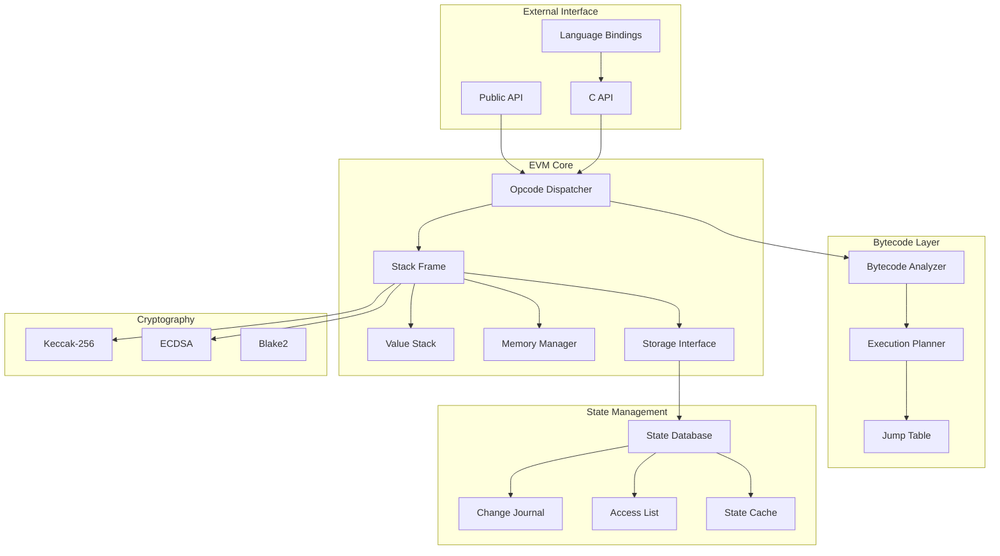

# Architecture Overview

Guillotine is built from the ground up with performance, correctness, and maintainability as primary goals. This document provides a comprehensive overview of the architectural decisions and design patterns that make Guillotine one of the fastest EVM implementations available.

## 🎯 Design Philosophy

### Core Principles

<div style={{ display: 'grid', gridTemplateColumns: 'repeat(auto-fit, minmax(300px, 1fr))', gap: '1.5rem', marginBottom: '2rem' }}>
  <div style={{
    padding: '1.5rem',
    background: 'linear-gradient(135deg, rgba(234, 88, 12, 0.05), rgba(220, 38, 38, 0.02))',
    border: '1px solid rgba(234, 88, 12, 0.2)',
    borderRadius: '12px'
  }}>
    <h3 style={{ marginTop: 0, color: '#EA580C' }}>Data-Oriented Design</h3>
    <p>Optimize for CPU cache efficiency, minimize pointer chasing, and keep hot data contiguous in memory.</p>
  </div>
  
  <div style={{
    padding: '1.5rem',
    background: 'linear-gradient(135deg, rgba(59, 130, 246, 0.05), rgba(37, 99, 235, 0.02))',
    border: '1px solid rgba(59, 130, 246, 0.2)',
    borderRadius: '12px'
  }}>
    <h3 style={{ marginTop: 0, color: '#3B82F6' }}>Zero-Cost Abstractions</h3>
    <p>Leverage Zig's comptime to provide flexibility without runtime overhead. Pay only for what you use.</p>
  </div>
  
  <div style={{
    padding: '1.5rem',
    background: 'linear-gradient(135deg, rgba(16, 185, 129, 0.05), rgba(5, 150, 105, 0.02))',
    border: '1px solid rgba(16, 185, 129, 0.2)',
    borderRadius: '12px'
  }}>
    <h3 style={{ marginTop: 0, color: '#10B981' }}>Predictable Performance</h3>
    <p>Minimize allocations, avoid hidden control flow, and provide consistent execution times.</p>
  </div>
</div>

## 🏗️ System Architecture



## 💡 Key Innovations

### 1. Indirect Threading via Tail Calls

Traditional interpreters suffer from poor branch prediction due to the central dispatch loop. Guillotine uses **indirect threading with tail-call optimization** to eliminate this bottleneck:

```zig
// Traditional dispatch (poor branch prediction)
while (true) {
    const opcode = bytecode[pc];
    switch (opcode) {
        0x01 => add(),
        0x02 => mul(),
        // ... hundreds of cases
    }
}

// Guillotine's approach (excellent branch prediction)
pub fn add(self: *Frame) Error!void {
    const b = self.stack.pop_unsafe();
    const a = self.stack.peek_unsafe();
    self.stack.set_top_unsafe(a +% b);
    
    // Tail call to next instruction
    return self.dispatch_next();
}
```

**Result**: ~25% performance improvement from better CPU branch prediction.

### 2. Optimized Stack Frame Layout

The `StackFrame` structure is carefully designed for cache efficiency:

```zig
pub const StackFrame = struct {
    // Hot data (frequently accessed) - fits in L1 cache line
    pc: u32,              // Program counter
    gas: i64,             // Gas remaining
    stack_ptr: u8,        // Stack pointer
    
    // Warm data (occasionally accessed)
    contract: Contract,   // Current contract
    memory: Memory,       // Memory instance
    
    // Cold data (rarely accessed)
    return_data: []u8,    // Return data buffer
    logs: []Log,          // Emitted logs
};
```

### 3. Bytecode Analysis & Planning

Before execution, Guillotine analyzes bytecode to:

- **Pre-validate jumps**: Build jump destination table
- **Identify patterns**: Detect common opcode sequences for fusion
- **Calculate gas**: Batch static gas calculations
- **Optimize dispatch**: Create optimized execution plan

```zig
pub const BytecodeStats = struct {
    jump_dests: BitSet,        // Valid jump destinations
    max_stack_height: u16,     // Maximum stack usage
    static_gas_cost: u64,      // Total static gas
    has_dynamic_jumps: bool,   // Contains JUMP opcodes
    fusable_sequences: []Fusion, // Optimizable patterns
};
```

### 4. Opcode Fusion

Common patterns are fused into single operations:

```zig
// Pattern: PUSH1 0x20 + ADD (common for array access)
pub fn push1_0x20_add(self: *Frame) Error!void {
    const top = self.stack.peek_unsafe();
    self.stack.set_top_unsafe(top + 0x20);
    return self.dispatch_next();
}

// Pattern: DUP1 + SWAP1 (stack manipulation)
pub fn dup1_swap1(self: *Frame) Error!void {
    const top = self.stack.items[self.stack.len - 1];
    const second = self.stack.items[self.stack.len - 2];
    self.stack.push_unsafe(second);
    self.stack.items[self.stack.len - 2] = top;
    return self.dispatch_next();
}
```

## 🎯 Memory Management

### Allocation Strategy

Guillotine follows a strict allocation hierarchy:

1. **Stack Allocation** (preferred)
   - Fixed-size buffers
   - Temporary data
   - Small structs

2. **Arena Allocation** (bulk operations)
   - Transaction-scoped data
   - Batch allocations
   - Automatic cleanup

3. **Heap Allocation** (last resort)
   - Dynamic arrays
   - Long-lived state
   - Always paired with defer/errdefer

```zig
// Example: Arena allocation for transaction
pub fn execute_transaction(self: *Evm, tx: Transaction) !Receipt {
    var arena = std.heap.ArenaAllocator.init(self.allocator);
    defer arena.deinit(); // Automatic cleanup
    
    const frame = try self.create_frame(&arena.allocator, tx);
    const result = try frame.execute();
    
    return self.build_receipt(result);
}
```

### Memory Safety

All allocations follow RAII principles:

```zig
// Pattern 1: Immediate defer
const buffer = try allocator.alloc(u8, size);
defer allocator.free(buffer);

// Pattern 2: Error defer for ownership transfer
const state = try allocator.create(State);
errdefer allocator.destroy(state);
state.* = try State.init(allocator);
return state; // Ownership transferred to caller
```

## 🔄 State Management

### Journaling System

Guillotine uses a journaling system for efficient state rollback:

```zig
pub const Journal = struct {
    entries: std.ArrayList(JournalEntry),
    checkpoints: std.ArrayList(usize),
    
    pub fn checkpoint(self: *Journal) !void {
        try self.checkpoints.append(self.entries.items.len);
    }
    
    pub fn revert(self: *Journal) !void {
        const checkpoint = self.checkpoints.pop();
        // Revert all changes after checkpoint
        while (self.entries.items.len > checkpoint) {
            const entry = self.entries.pop();
            entry.revert();
        }
    }
};
```

### Access List Optimization

EIP-2929 access lists are optimized for fast lookups:

```zig
pub const AccessList = struct {
    addresses: std.AutoHashMap(Address, void),
    slots: std.AutoHashMap(StorageKey, void),
    
    // Optimized check with caching
    pub fn is_warm(self: *AccessList, addr: Address, slot: ?U256) bool {
        if (!self.addresses.contains(addr)) return false;
        if (slot) |s| {
            const key = StorageKey{ .address = addr, .slot = s };
            return self.slots.contains(key);
        }
        return true;
    }
};
```

## ⚡ Performance Optimizations

### 1. Unsafe Operations

For pre-validated operations, Guillotine provides unsafe variants:

```zig
pub const Stack = struct {
    items: [1024]U256,
    len: u16,
    
    // Safe version with bounds checking
    pub fn push(self: *Stack, value: U256) Error!void {
        if (self.len >= 1024) return Error.StackOverflow;
        self.items[self.len] = value;
        self.len += 1;
    }
    
    // Unsafe version for validated operations
    pub fn push_unsafe(self: *Stack, value: U256) void {
        self.items[self.len] = value;
        self.len += 1;
    }
};
```

### 2. Branch-Free Code

Critical paths use branch-free implementations:

```zig
// Branch-free min/max
pub fn min(a: u256, b: u256) u256 {
    return a ^ ((a ^ b) & @as(u256, @bitCast(@as(i256, @intCast(a)) > @as(i256, @intCast(b)))) - 1);
}

// Branch-free conditional
pub fn select(condition: bool, a: u256, b: u256) u256 {
    const mask = @as(u256, @boolToInt(condition)) -% 1;
    return (a & ~mask) | (b & mask);
}
```

### 3. SIMD Operations

Where available, SIMD instructions accelerate operations:

```zig
// SIMD memory copy
pub fn memory_copy(dst: []u8, src: []const u8) void {
    if (src.len >= 32) {
        // Use SIMD for large copies
        @memcpy(dst, src);
    } else {
        // Inline for small copies
        for (src, 0..) |byte, i| {
            dst[i] = byte;
        }
    }
}
```

## 🧪 Testing Architecture

### Differential Testing

Guillotine is continuously tested against Revm:

```zig
test "differential_testing" {
    const test_cases = try load_test_cases();
    
    for (test_cases) |case| {
        const guillotine_result = try guillotine.execute(case);
        const revm_result = try revm.execute(case);
        
        try std.testing.expectEqual(revm_result, guillotine_result);
    }
}
```

### Fuzz Testing

Property-based testing ensures correctness:

```zig
test "fuzz_arithmetic" {
    var prng = std.rand.DefaultPrng.init(seed);
    const random = prng.random();
    
    var i: usize = 0;
    while (i < 10000) : (i += 1) {
        const a = random.int(u256);
        const b = random.int(u256);
        
        // Test commutativity
        try expectEqual(add(a, b), add(b, a));
        
        // Test associativity
        const c = random.int(u256);
        try expectEqual(add(add(a, b), c), add(a, add(b, c)));
    }
}
```

## 📈 Metrics & Monitoring

### Performance Metrics

Guillotine tracks key performance indicators:

```zig
pub const Metrics = struct {
    opcodes_executed: u64,
    gas_used: u64,
    memory_allocated: usize,
    cache_hits: u64,
    cache_misses: u64,
    
    pub fn report(self: *Metrics) void {
        const hit_rate = @as(f64, self.cache_hits) / 
                        @as(f64, self.cache_hits + self.cache_misses);
        
        log.info("Performance Report:", .{});
        log.info("  Opcodes/sec: {d}", .{self.opcodes_per_second()});
        log.info("  Cache hit rate: {d:.2}%", .{hit_rate * 100});
        log.info("  Memory usage: {}", .{std.fmt.fmtIntSizeBin(self.memory_allocated)});
    }
};
```

## 🔮 Future Optimizations

### Register-Based VM

Convert stack-based operations to register-based for ~30% performance gain:

```zig
// Future: Register-based execution
pub const RegisterVM = struct {
    registers: [256]U256,  // Virtual registers
    
    // ADD R1, R2, R3  (R1 = R2 + R3)
    pub fn add_reg(self: *RegisterVM, dst: u8, src1: u8, src2: u8) void {
        self.registers[dst] = self.registers[src1] +% self.registers[src2];
    }
};
```

### JIT Compilation

Selective JIT compilation for hot paths:

```zig
// Future: JIT compilation for hot contracts
pub const JIT = struct {
    threshold: u32 = 1000,  // Execution count before JIT
    
    pub fn maybe_compile(self: *JIT, contract: *Contract) void {
        if (contract.exec_count > self.threshold) {
            const native_code = self.compile_to_native(contract.bytecode);
            contract.native_code = native_code;
        }
    }
};
```

## 📚 Further Reading

- [EVM Core Implementation →](/advanced/architecture/evm-core)
- [Bytecode Analysis →](/advanced/architecture/bytecode)
- [Memory Management →](/advanced/architecture/memory)
- [State Management →](/advanced/architecture/state)
- [Performance Optimization Guide →](/advanced/performance/optimization)

---

<div style={{ marginTop: '3rem', padding: '1.5rem', background: 'linear-gradient(135deg, rgba(234, 88, 12, 0.05), rgba(220, 38, 38, 0.02))', border: '1px solid rgba(234, 88, 12, 0.2)', borderRadius: '12px' }}>
  <h3 style={{ marginTop: 0 }}>🚀 Ready to Dive Deeper?</h3>
  <p>Explore the implementation details of each component or start building with Guillotine.</p>
  <div style={{ display: 'flex', gap: '1rem', marginTop: '1rem' }}>
    <a href="/advanced/architecture/evm-core" style={{ padding: '0.5rem 1rem', background: '#EA580C', color: 'white', borderRadius: '8px', textDecoration: 'none' }}>
      Explore EVM Core →
    </a>
    <a href="/getting-started/quick-start" style={{ padding: '0.5rem 1rem', border: '1px solid #EA580C', color: '#EA580C', borderRadius: '8px', textDecoration: 'none' }}>
      Quick Start Guide →
    </a>
  </div>
</div>