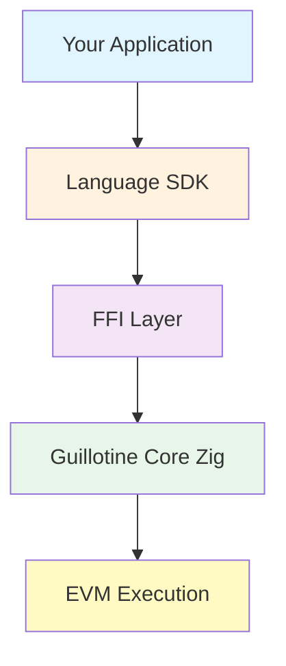

# SDKs Overview

Guillotine provides SDK bindings for multiple programming languages, allowing you to integrate the high-performance EVM implementation into your applications. All SDKs use FFI (Foreign Function Interface) to interact with the core Zig implementation, ensuring consistent behavior and optimal performance across languages.

## Available SDKs

### Production Ready

#### [Go SDK](/sdks/go)
The most mature SDK with idiomatic Go interfaces, comprehensive testing, and production-ready features.

- Native Go types (`*big.Int`, `[]byte`)
- Thread-safe operations
- Comprehensive error handling
- Full test coverage with benchmarks
- CGO bindings for optimal performance

**Status:** ✅ Production Ready

---

### Experimental SDKs

These SDKs are functional but still under active development. APIs may change.

#### [Rust SDK](/sdks/rust)
Safe Rust wrapper with RAII patterns and integration with the Alloy ecosystem.

- Zero-copy FFI where possible
- Integration with `alloy-primitives`
- Thread-safe VM instances
- Automatic C binding generation

**Status:** 🧪 Experimental

#### [Python SDK](/sdks/python)
Type-safe Python bindings with CFFI for performance.

- Full type hints for IDE support
- Built-in Solidity compiler integration
- Context manager support
- Cross-platform (Linux, macOS, Windows)

**Status:** 🧪 Experimental

#### [TypeScript SDK](/sdks/typescript)
WebAssembly-based implementation for universal JavaScript compatibility.

- Works in Node.js, Bun, and browsers
- Full TypeScript support
- Async/Promise-based API
- Custom tracer support

**Status:** 🧪 Experimental

#### [Bun SDK](/sdks/bun)
Native Bun FFI bindings for maximum performance in Bun runtime.

- Zero-copy operations
- High-performance benchmarks (0.23-0.80ms)
- Native Bun FFI integration
- Complete API coverage

**Status:** 🧪 Experimental

#### [Swift SDK](/sdks/swift)
Native Swift Package Manager support for macOS and iOS applications.

- Type-safe Swift API
- Automatic memory management with ARC
- Custom primitive types
- macOS 12.0+ and iOS 15.0+ support

**Status:** 🧪 Experimental

#### [C SDK](/sdks/c)
Low-level C bindings that serve as the foundation for other language bindings.

- Raw C API
- Multiple module support
- Static and shared library options
- Foundation for other SDKs

**Status:** 🧪 Experimental

## Quick Comparison

| SDK | Language | Status | Performance | Platform Support | Package Manager |
|-----|----------|--------|-------------|------------------|-----------------|
| **Go** | Go 1.18+ | Production | High (CGO) | Linux, macOS, Windows | `go get` |
| **Rust** | Rust 1.70+ | Experimental | High (Zero-copy FFI) | Linux, macOS, Windows | `cargo` |
| **Python** | Python 3.8-3.12 | Experimental | Good (CFFI) | Linux, macOS, Windows | `pip` |
| **TypeScript** | TypeScript 5.0+ | Experimental | Good (WASM) | Universal | `npm`/`yarn`/`pnpm` |
| **Bun** | Bun 1.0+ | Experimental | High (Native FFI) | Linux, macOS | `bun` |
| **Swift** | Swift 5.9+ | Experimental | High (Native) | macOS, iOS | Swift Package Manager |
| **C** | C99+ | Experimental | Highest (Direct) | Linux, macOS, Windows | Manual/CMake |

## Common Features

All SDKs provide consistent interfaces for:

### Core Operations
- EVM instance creation and management
- Contract deployment and execution
- All call types (CALL, DELEGATECALL, STATICCALL, CREATE, CREATE2)

### State Management
- Account balance operations
- Contract code deployment
- Storage read/write operations

### Primitive Types
- `Address` - 20-byte Ethereum addresses
- `U256` - 256-bit unsigned integers
- `Hash` - 32-byte hash values
- `Bytes` - Dynamic byte arrays

### Error Handling
- Language-appropriate error patterns
- Comprehensive error codes
- Detailed execution results

## Installation

### Prerequisites

All SDKs require the Guillotine shared library. Build it first:

```bash
# Clone the repository
git clone https://github.com/evmts/guillotine
cd guillotine

# Build shared library
zig build shared -Doptimize=ReleaseFast

# The library will be in zig-out/lib/
ls zig-out/lib/
```

### SDK-Specific Installation

<Tabs items={['Go', 'Rust', 'Python', 'TypeScript', 'Bun', 'Swift']}>
  <Tab value="Go">
    ```bash
    go get github.com/evmts/guillotine/sdks/go
    ```
  </Tab>
  <Tab value="Rust">
    ```toml
    [dependencies]
    guillotine-rs = "0.1.0"
    ```
  </Tab>
  <Tab value="Python">
    ```bash
    pip install guillotine-evm
    ```
  </Tab>
  <Tab value="TypeScript">
    ```bash
    npm install @evmts/guillotine
    ```
  </Tab>
  <Tab value="Bun">
    ```bash
    bun add @guillotine/bun
    ```
  </Tab>
  <Tab value="Swift">
    ```swift
    // Package.swift
    dependencies: [
        .package(url: "https://github.com/evmts/guillotine-swift", from: "0.1.0")
    ]
    ```
  </Tab>
</Tabs>

## Quick Start Examples

### Basic EVM Execution

All SDKs follow a similar pattern for basic EVM operations:

<Tabs items={['Go', 'Rust', 'Python', 'TypeScript']}>
  <Tab value="Go">
    ```go
    vm := evm.New()
    defer vm.Destroy()
    
    result, err := vm.Call(&evm.CallParams{
        Caller:   caller,
        Target:   target,
        Value:    big.NewInt(1000),
        Input:    []byte{},
        GasLimit: 1000000,
    })
    ```
  </Tab>
  <Tab value="Rust">
    ```rust
    let mut evm = Evm::new();
    
    let result = evm.call(CallParams {
        caller,
        target: Some(target),
        value: U256::from(1000),
        input: vec![],
        gas_limit: 1000000,
        call_type: CallType::Call,
    })?;
    ```
  </Tab>
  <Tab value="Python">
    ```python
    with EVM() as evm:
        result = evm.call(
            caller=caller,
            target=target,
            value=1000,
            input=b'',
            gas_limit=1000000
        )
    ```
  </Tab>
  <Tab value="TypeScript">
    ```typescript
    const evm = await EVM.create();
    
    const result = await evm.call({
        caller,
        target,
        value: 1000n,
        input: new Uint8Array(),
        gasLimit: 1000000n
    });
    ```
  </Tab>
</Tabs>

## Architecture



### How It Works

1. **Application Layer**: Your application code in your preferred language
2. **SDK Layer**: Language-specific bindings providing idiomatic interfaces
3. **FFI Layer**: Foreign Function Interface bridge to the Zig implementation
4. **Core Layer**: High-performance Guillotine EVM implementation in Zig
5. **Execution Layer**: Actual EVM bytecode execution

## Performance Considerations

### FFI Overhead
- Minimal for single operations
- Consider batching for multiple operations
- Use appropriate SDK for your use case

### Memory Management
- SDKs handle memory management automatically
- Follow language-specific best practices
- Proper cleanup prevents memory leaks

### Threading
- Most SDKs are thread-safe
- Check SDK-specific documentation
- Consider connection pooling for high throughput

## Choosing an SDK

Consider these factors when selecting an SDK:

### Use Go SDK if:
- You need production stability
- You're building Go applications
- You want the most mature option

### Use Rust SDK if:
- You need maximum performance
- You're in the Rust/Alloy ecosystem
- You want zero-copy operations

### Use Python SDK if:
- You're doing data analysis or research
- You need quick prototyping
- You want Solidity compiler integration

### Use TypeScript SDK if:
- You need browser compatibility
- You're building web applications
- You want universal JavaScript support

### Use Bun SDK if:
- You're using Bun runtime
- You need maximum JS performance
- You want native FFI integration

### Use Swift SDK if:
- You're building iOS/macOS apps
- You need native Apple platform support
- You want Swift-native interfaces

## Contributing

We welcome contributions to all SDKs! Each SDK follows the patterns and conventions of its respective language ecosystem.

### Development Setup

1. Fork the repository
2. Build the core library
3. Navigate to the SDK directory
4. Follow language-specific development practices

### Testing

Each SDK includes comprehensive tests:

```bash
# Go
cd sdks/go && go test ./...

# Rust
cd sdks/rust && cargo test

# Python
cd sdks/python && pytest

# TypeScript
cd sdks/typescript && npm test

# Bun
cd sdks/bun && bun test

# Swift
cd sdks/swift && swift test
```

## Support

- [GitHub Issues](https://github.com/evmts/guillotine/issues)
- [Discord Community](https://discord.gg/guillotine)
- [Documentation](/)

## License

All SDKs are released under the same license as the Guillotine project. See the LICENSE file in each SDK directory for details.