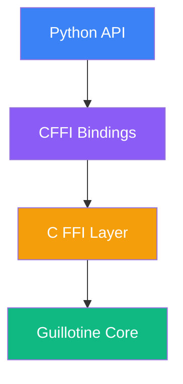

import { Callout } from 'vocs/components'

# Python SDK

Python bindings for the Guillotine EVM - a high-performance Ethereum Virtual Machine implementation written in Zig.

<Callout type="warning">
**Experimental/PoC**: This SDK is a vibecoded proof-of-concept. APIs are unstable and may change. We're looking for early users to try it and tell us what APIs you want.

- **Maturity**: Experimental proof-of-concept
- **API stability**: Unstable; breaking changes expected
- **Feedback**: [GitHub Issues](https://github.com/evmts/Guillotine/issues) or [Telegram](https://t.me/+ANThR9bHDLAwMjUx)
</Callout>

## Features

- **High Performance**: Direct bindings to the optimized Zig EVM implementation
- **Type Safety**: Full Python type hints and runtime type checking
- **Comprehensive API**: Support for EVM execution, state management, and primitives
- **Cross Platform**: Works on Linux, macOS, and Windows
- **Memory Safe**: Proper memory management and cleanup

## Installation

::::steps
### Install from PyPI

```bash
pip install guillotine-evm
```

### Or install from source

```bash
# Clone the repository
git clone https://github.com/evmts/guillotine.git
cd guillotine/sdks/python

# Install development dependencies
pip install -e ".[dev]"
```
::::

## Quick Start

### Basic Example

```python filename="basic_example.py" showLineNumbers
from guillotine_evm import EVM, BlockInfo, CallType, CallParams

# Initialize EVM with block context
evm = EVM(BlockInfo(
    number=1,
    timestamp=1,
    gas_limit=30_000_000,
    coinbase="0x" + "00" * 20,
    base_fee=1_000_000_000,
    chain_id=1,
))

# Set up accounts
caller = "0x" + "11" * 20
to = "0x" + "22" * 20
evm.set_balance(caller, 10**18)

# Helper to create bytecode that returns 32 bytes
def push32_return_bytes(data: bytes) -> bytes:
    assert len(data) == 32
    return bytes([0x7F]) + data + bytes([0x60, 0x00, 0x52, 0x60, 0x20, 0x60, 0x00, 0xF3])

# Deploy contract that returns 42
ret = (b"\x00" * 31) + b"\x2a"
evm.set_code(to, push32_return_bytes(ret))

# Execute call
result = evm.call(CallParams(
    caller=caller,
    to=to,
    value=0,
    input=b"",
    gas=100_000,
    call_type=CallType.CALL,
))

print("Success:", result.success)
print("Gas left:", result.gas_left)
print("Output:", result.output.hex())

# Clean up
evm.destroy()
```

### Using Primitives

```python filename="primitives_example.py"
from guillotine_evm.primitives import Address, U256, Hash

# Create addresses
addr = Address.from_hex("0x742d35Cc6634C0532925a3b844Bc9e7595f0bEb")
zero_addr = Address.zero()

# Work with 256-bit integers
value = U256.from_int(1_000_000_000_000_000_000)  # 1 ETH
gas_price = U256.from_int(20_000_000_000)  # 20 gwei

# Create hashes
tx_hash = Hash.from_hex("0xabc...")
block_hash = Hash.keccak256(b"block data")
```

## API Reference

### EVM Class

The main execution engine for running EVM bytecode.

:::code-group

```python [Initialization]
from guillotine_evm import EVM, BlockInfo

evm = EVM(BlockInfo(
    number=18_000_000,
    timestamp=1_700_000_000,
    gas_limit=30_000_000,
    coinbase="0x0000000000000000000000000000000000000000",
    base_fee=1_000_000_000,
    chain_id=1,
))
```

```python [State Management]
# Set account balance
evm.set_balance("0x...", 10**18)

# Deploy contract code
evm.set_code("0x...", bytecode)

# Get account info
balance = evm.get_balance("0x...")
nonce = evm.get_nonce("0x...")
```

```python [Execution]
from guillotine_evm import CallParams, CallType

result = evm.call(CallParams(
    caller="0x...",
    to="0x...",
    value=0,
    input=b"",
    gas=100_000,
    call_type=CallType.CALL,
))

# Check result
if result.success:
    print(f"Output: {result.output.hex()}")
else:
    print(f"Failed with gas left: {result.gas_left}")
```

```python [Simulation]
# Simulate without modifying state
sim_result = evm.simulate(CallParams(...))
```

:::

### CallParams

Parameters for executing EVM calls.

| Field | Type | Description |
|-------|------|-------------|
| `caller` | `str` | Address initiating the call |
| `to` | `str` | Target address |
| `value` | `int` | Wei to transfer |
| `input` | `bytes` | Call data |
| `gas` | `int` | Gas limit |
| `call_type` | `CallType` | Type of call (CALL, DELEGATECALL, etc.) |

### CallResult

Result from EVM execution.

| Field | Type | Description |
|-------|------|-------------|
| `success` | `bool` | Whether execution succeeded |
| `gas_left` | `int` | Remaining gas |
| `output` | `bytes` | Return data |
| `logs` | `List[Log]` | Emitted logs |

## Advanced Usage

### Contract Deployment

```python filename="deploy.py"
def deploy_contract(evm, deployer, bytecode, constructor_args=b""):
    """Deploy a contract and return its address."""
    
    # Combine bytecode with constructor arguments
    init_code = bytecode + constructor_args
    
    # Execute deployment (to=None for CREATE)
    result = evm.call(CallParams(
        caller=deployer,
        to=None,  # CREATE operation
        value=0,
        input=init_code,
        gas=5_000_000,
        call_type=CallType.CREATE,
    ))
    
    if result.success:
        # Contract address is in the output
        contract_address = result.created_address
        return contract_address
    else:
        raise Exception(f"Deployment failed: {result.output.hex()}")
```

### Working with ABI

```python filename="abi_encoding.py"
from eth_abi import encode, decode

# Encode function call
function_selector = bytes.fromhex("a9059cbb")  # transfer(address,uint256)
recipient = "0x742d35Cc6634C0532925a3b844Bc9e7595f0bEb"
amount = 1000000000000000000  # 1 ETH

encoded_data = function_selector + encode(
    ["address", "uint256"],
    [recipient, amount]
)

# Execute the call
result = evm.call(CallParams(
    caller=sender,
    to=token_contract,
    value=0,
    input=encoded_data,
    gas=100_000,
    call_type=CallType.CALL,
))

# Decode return value
if result.success and len(result.output) > 0:
    [success] = decode(["bool"], result.output)
    print(f"Transfer successful: {success}")
```

### Error Handling

```python filename="error_handling.py"
from guillotine_evm import EVMError

try:
    result = evm.call(params)
    
    if result.success:
        print(f"Success! Output: {result.output.hex()}")
    elif result.is_revert:
        # Handle revert with reason
        reason = decode_revert_reason(result.output)
        print(f"Reverted: {reason}")
    else:
        # Execution failed
        print(f"Failed with error: {result.error}")
        
except EVMError as e:
    # Handle EVM-specific errors
    print(f"EVM error: {e}")
except Exception as e:
    # Handle general errors
    print(f"Unexpected error: {e}")
```

## Performance Tips

<div style={{ display: 'grid', gridTemplateColumns: 'repeat(auto-fit, minmax(250px, 1fr))', gap: '1rem', marginBottom: '2rem' }}>
  <div style={{
    padding: '1rem',
    background: 'var(--vocs-color_background2)',
    border: '1px solid var(--vocs-color_border)',
    borderRadius: '8px'
  }}>
    <h4 style={{ marginTop: 0, color: '#10B981' }}>✅ Do</h4>
    <ul style={{ margin: 0 }}>
      <li>Reuse EVM instances when possible</li>
      <li>Use batch operations for multiple calls</li>
      <li>Pre-compile frequently used contracts</li>
      <li>Use <code>simulate()</code> for read-only operations</li>
    </ul>
  </div>
  
  <div style={{
    padding: '1rem',
    background: 'var(--vocs-color_background2)',
    border: '1px solid var(--vocs-color_border)',
    borderRadius: '8px'
  }}>
    <h4 style={{ marginTop: 0, color: '#EF4444' }}>❌ Don't</h4>
    <ul style={{ margin: 0 }}>
      <li>Create new EVM instances per call</li>
      <li>Forget to call <code>destroy()</code></li>
      <li>Use excessive gas limits</li>
      <li>Ignore error handling</li>
    </ul>
  </div>
</div>

## Development

### Running Tests

```bash
# Run all tests
pytest

# Run with coverage
pytest --cov=guillotine_evm

# Run specific test file
pytest tests/test_evm.py
```

### Type Checking

```bash
# Run mypy type checker
mypy guillotine_evm

# Run with strict mode
mypy --strict guillotine_evm
```

### Building from Source

::::steps
### Build Guillotine Core

```bash
cd ../..
zig build -Doptimize=ReleaseFast
```

### Build Python Extension

```bash
cd sdks/python
python -m build
```

### Install Locally

```bash
pip install -e .
```
::::

## Architecture

The Python bindings use CFFI to interface with the native Guillotine EVM library:



## Troubleshooting

:::details[ImportError: cannot import name 'EVM']
**Solution**: Ensure the Guillotine shared library is built:
```bash
cd ../..
zig build shared
```
:::

:::details[Segmentation fault when calling EVM]
**Solution**: Make sure to properly initialize the EVM and always call `destroy()`:
```python
evm = EVM(BlockInfo(...))
try:
    # Use EVM
    pass
finally:
    evm.destroy()
```
:::

:::details[Type hints not working in IDE]
**Solution**: Install type stubs:
```bash
pip install types-guillotine-evm
```
:::

## Next Steps

<div style={{ display: 'grid', gridTemplateColumns: 'repeat(2, 1fr)', gap: '1rem', marginTop: '2rem' }}>
  <a href="/sdks/rust" style={{
    display: 'block',
    padding: '1.5rem',
    background: 'linear-gradient(135deg, rgba(234, 88, 12, 0.1), rgba(220, 38, 38, 0.05))',
    border: '1px solid rgba(234, 88, 12, 0.3)',
    borderRadius: '12px',
    textDecoration: 'none'
  }}>
    <h3 style={{ margin: '0 0 0.5rem 0' }}>🦀 Rust SDK</h3>
    <p style={{ margin: 0, color: 'var(--vocs-color_text2)' }}>
      Safe, zero-copy Rust bindings
    </p>
  </a>
  
  <a href="/sdks/typescript" style={{
    display: 'block',
    padding: '1.5rem',
    background: 'linear-gradient(135deg, rgba(59, 130, 246, 0.1), rgba(37, 99, 235, 0.05))',
    border: '1px solid rgba(59, 130, 246, 0.3)',
    borderRadius: '12px',
    textDecoration: 'none'
  }}>
    <h3 style={{ margin: '0 0 0.5rem 0' }}>📘 TypeScript SDK</h3>
    <p style={{ margin: 0, color: 'var(--vocs-color_text2)' }}>
      Type-safe JavaScript bindings
    </p>
  </a>
</div>

## Support

<Callout type="info">
  **Need help?**
  - 📖 Browse [examples](https://github.com/evmts/Guillotine/tree/main/sdks/python/examples)
  - 💬 Join our [Telegram community](https://t.me/+ANThR9bHDLAwMjUx)
  - 🐛 Report [issues on GitHub](https://github.com/evmts/Guillotine/issues)
</Callout>