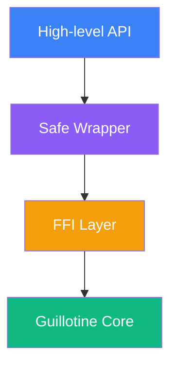

import { Callout } from 'vocs/components'

# Rust SDK

A safe Rust wrapper around the Guillotine EVM - a high-performance Ethereum Virtual Machine implementation written in Zig.

<Callout type="warning">
**Experimental/PoC**: This SDK is a vibecoded proof-of-concept. APIs are unstable and may change. We're looking for early users to try it and tell us what APIs you want.

- **Maturity**: Experimental proof-of-concept
- **API stability**: Unstable; breaking changes expected
- **Feedback**: [GitHub Issues](https://github.com/evmts/Guillotine/issues) or [Telegram](https://t.me/+ANThR9bHDLAwMjUx)
</Callout>

## Features

- **Safe API**: All unsafe FFI calls are wrapped in safe Rust abstractions
- **Zero-copy where possible**: Minimizes data copying between Rust and Zig
- **Idiomatic Rust**: Uses standard Rust patterns like `Result`, `Option`, and RAII
- **Compatible with Ethereum ecosystem**: Works with alloy-primitives types
- **Thread-safe**: VM instances can be safely sent between threads
- **Comprehensive error handling**: All errors are properly propagated

## Installation

Add to your `Cargo.toml`:

```toml filename="Cargo.toml"
[dependencies]
guillotine-rs = "0.1.0"
alloy-primitives = "0.7"
```

## Quick Start

### Basic Example

```rust filename="main.rs" showLineNumbers
use guillotine_rs::{Evm, EvmBuilder, ExecutionResult};
use alloy_primitives::{Address, U256};

fn main() -> Result<(), Box<dyn std::error::Error>> {
    // Create a new EVM instance
    let mut evm = EvmBuilder::new()
        .with_gas_limit(1_000_000)
        .build()?;

    // Set up accounts
    let sender = Address::from([0x11; 20]);
    let receiver = Address::from([0x22; 20]);

    evm.set_balance(sender, U256::from(1_000_000))?;

    // Deploy a contract
    let bytecode = hex::decode("608060...")?;
    let contract_address = evm.deploy_contract(sender, bytecode, U256::ZERO)?;

    // Execute a contract call
    let input = hex::decode("a9059cbb...")?; // transfer(address,uint256)
    let result = evm.call(sender, contract_address, input, U256::ZERO)?;

    match result {
        ExecutionResult::Success { output, gas_used, logs } => {
            println!("Success! Gas used: {}", gas_used);
            println!("Output: 0x{}", hex::encode(output));
        }
        ExecutionResult::Revert { output, gas_used } => {
            println!("Reverted: {:?}", output);
        }
        ExecutionResult::Failure { error, gas_used } => {
            println!("Failed: {}", error);
        }
    }

    Ok(())
}
```

### Using Builder Pattern

```rust filename="builder.rs"
use guillotine_rs::{EvmBuilder, BlockContext, TransactionContext};
use alloy_primitives::{Address, U256};

let evm = EvmBuilder::new()
    .with_block_context(BlockContext {
        number: 18_000_000,
        timestamp: 1_700_000_000,
        gas_limit: 30_000_000,
        coinbase: Address::ZERO,
        base_fee: U256::from(1_000_000_000),
    })
    .with_transaction_context(TransactionContext {
        origin: Address::from([0x11; 20]),
        gas_price: U256::from(20_000_000_000),
        chain_id: 1,
    })
    .with_gas_limit(5_000_000)
    .build()?;
```

## API Reference

### EVM Struct

The main execution engine for running EVM bytecode.

:::code-group

```rust [Creation]
use guillotine_rs::{Evm, EvmBuilder};

// Simple creation
let evm = Evm::new()?;

// With builder
let evm = EvmBuilder::new()
    .with_gas_limit(1_000_000)
    .build()?;
```

```rust [State Management]
use alloy_primitives::{Address, U256, B256};

// Set balance
evm.set_balance(address, U256::from(1_000_000))?;

// Deploy code
let code_hash = evm.set_code(address, &bytecode)?;

// Get account info
let balance = evm.get_balance(address)?;
let nonce = evm.get_nonce(address)?;
let code = evm.get_code(address)?;
```

```rust [Execution]
// Call a contract
let result = evm.call(
    caller,
    contract_address,
    input_data,
    value
)?;

// Create a new contract
let address = evm.create(
    deployer,
    init_code,
    value
)?;

// Static call (read-only)
let output = evm.static_call(
    caller,
    contract_address,
    input_data
)?;
```

:::

### ExecutionResult

Result from EVM execution with multiple variants.

```rust
pub enum ExecutionResult {
    Success {
        output: Vec<u8>,
        gas_used: u64,
        logs: Vec<Log>,
    },
    Revert {
        output: Vec<u8>,
        gas_used: u64,
    },
    Failure {
        error: EvmError,
        gas_used: u64,
    },
}
```

### Error Handling

```rust
use guillotine_rs::{EvmError, ExecutionResult};

match evm.call(sender, to, data, value) {
    Ok(ExecutionResult::Success { output, .. }) => {
        // Handle success
    }
    Ok(ExecutionResult::Revert { output, .. }) => {
        // Decode revert reason
        let reason = decode_revert_string(&output);
        eprintln!("Reverted: {}", reason);
    }
    Ok(ExecutionResult::Failure { error, .. }) => {
        // Handle EVM failure
        match error {
            EvmError::OutOfGas => eprintln!("Out of gas"),
            EvmError::StackUnderflow => eprintln!("Stack underflow"),
            EvmError::InvalidOpcode(op) => eprintln!("Invalid opcode: 0x{:02x}", op),
            _ => eprintln!("EVM error: {:?}", error),
        }
    }
    Err(e) => {
        // Handle FFI or other errors
        eprintln!("Failed to execute: {}", e);
    }
}
```

## Advanced Usage

### Transaction Simulation

```rust filename="simulation.rs"
use guillotine_rs::{Evm, SimulationOptions};

// Simulate without modifying state
let result = evm.simulate_call(
    sender,
    to,
    data,
    value,
    SimulationOptions {
        commit_changes: false,
        trace_execution: true,
    }
)?;

if result.success {
    println!("Simulation successful");
    println!("Would use {} gas", result.gas_used);
    println!("Would produce {} logs", result.logs.len());
}
```

### Working with Traces

```rust filename="tracing.rs"
use guillotine_rs::{Evm, TraceOptions};

let evm = EvmBuilder::new()
    .with_tracing(TraceOptions {
        enable_memory: true,
        enable_stack: true,
        enable_storage: true,
    })
    .build()?;

let result = evm.call_with_trace(sender, to, data, value)?;

for step in result.trace {
    println!("PC: {}, Op: {:?}, Gas: {}", 
        step.pc, step.op, step.gas_remaining);
}
```

### Batch Operations

```rust filename="batch.rs"
use guillotine_rs::{Evm, BatchCall};

let calls = vec![
    BatchCall {
        from: sender,
        to: token_a,
        data: approve_data.clone(),
        value: U256::ZERO,
    },
    BatchCall {
        from: sender,
        to: dex,
        data: swap_data.clone(),
        value: U256::ZERO,
    },
];

let results = evm.batch_call(calls)?;

for (i, result) in results.iter().enumerate() {
    println!("Call {}: {:?}", i, result);
}
```

### Custom Precompiles

```rust filename="precompiles.rs"
use guillotine_rs::{Evm, Precompile, PrecompileResult};

struct CustomPrecompile;

impl Precompile for CustomPrecompile {
    fn execute(&self, input: &[u8], gas: u64) -> PrecompileResult {
        // Custom logic here
        let output = process_input(input);
        let gas_used = calculate_gas(input.len());
        
        PrecompileResult {
            output,
            gas_used,
            success: true,
        }
    }
}

let evm = EvmBuilder::new()
    .with_precompile(Address::from([0x09; 20]), Box::new(CustomPrecompile))
    .build()?;
```

## Architecture

The crate is structured in three layers for maximum safety and performance:



### Module Structure

| Module | Description |
|--------|------------|
| `api` | High-level, idiomatic Rust interface |
| `core` | Safe abstractions over FFI |
| `ffi` | Raw bindings to Guillotine C API |
| `types` | Rust types and conversions |
| `error` | Error types and handling |

## Performance

### Benchmarks

Run benchmarks comparing Guillotine to other EVM implementations:

```bash
# Run all benchmarks
cargo bench

# Run specific benchmark
cargo bench --bench erc20_transfer

# Generate flamegraph
cargo bench --bench heavy_computation -- --profile-time=10
```

### Optimization Tips

<div style={{ display: 'grid', gridTemplateColumns: 'repeat(auto-fit, minmax(250px, 1fr))', gap: '1rem', marginBottom: '2rem' }}>
  <div style={{
    padding: '1rem',
    background: 'var(--vocs-color_background2)',
    border: '1px solid var(--vocs-color_border)',
    borderRadius: '8px'
  }}>
    <h4 style={{ marginTop: 0, color: '#10B981' }}>✅ Do</h4>
    <ul style={{ margin: 0 }}>
      <li>Reuse EVM instances</li>
      <li>Use batch operations</li>
      <li>Pre-validate bytecode</li>
      <li>Use static calls for queries</li>
    </ul>
  </div>
  
  <div style={{
    padding: '1rem',
    background: 'var(--vocs-color_background2)',
    border: '1px solid var(--vocs-color_border)',
    borderRadius: '8px'
  }}>
    <h4 style={{ marginTop: 0, color: '#EF4444' }}>❌ Don't</h4>
    <ul style={{ margin: 0 }}>
      <li>Create EVMs per call</li>
      <li>Ignore error handling</li>
      <li>Use excessive gas limits</li>
      <li>Clone large data unnecessarily</li>
    </ul>
  </div>
</div>

## Safety

This crate ensures safety through:

- **RAII**: Automatic resource cleanup with Drop trait
- **Type Safety**: Strong typing prevents misuse
- **Validated Inputs**: All inputs validated before FFI
- **No Raw Pointers**: Safe abstractions only in public API

### Memory Safety Example

```rust
// EVM automatically cleaned up when dropped
{
    let evm = Evm::new()?;
    // Use EVM...
} // Automatically destroyed here

// Or explicit cleanup
let evm = Evm::new()?;
drop(evm); // Explicit cleanup
```

## Building from Source

::::steps
### Prerequisites

Ensure you have:
- Rust 1.70+
- Zig 0.14+
- C++ toolchain (for dependencies)

### Clone Repository

```bash
git clone https://github.com/evmts/Guillotine.git
cd Guillotine/sdks/rust
```

### Build

```bash
# Debug build
cargo build

# Release build
cargo build --release

# Run tests
cargo test

# Run with examples
cargo run --example basic_evm
```
::::

## Troubleshooting

:::details[Linking errors when building]
**Solution**: Ensure Guillotine is built first:
```bash
cd ../..
zig build -Doptimize=ReleaseFast
```
:::

:::details[Thread panic when using EVM]
**Solution**: EVMs are Send but not Sync. Use `Arc<Mutex<Evm>>` for sharing:
```rust
use std::sync::{Arc, Mutex};

let evm = Arc::new(Mutex::new(Evm::new()?));
```
:::

:::details[Performance regression in release mode]
**Solution**: Enable LTO in Cargo.toml:
```toml
[profile.release]
lto = true
codegen-units = 1
```
:::

## Examples

Check out the [examples directory](https://github.com/evmts/Guillotine/tree/main/sdks/rust/examples) for complete working examples:

- `basic_evm.rs` - Simple EVM usage
- `erc20_deploy.rs` - Deploy and interact with ERC20
- `uniswap_sim.rs` - Simulate Uniswap swaps
- `batch_tx.rs` - Batch transaction execution

Run examples with:
```bash
cargo run --example basic_evm
```

## Next Steps

<div style={{ display: 'grid', gridTemplateColumns: 'repeat(2, 1fr)', gap: '1rem', marginTop: '2rem' }}>
  <a href="/sdks/bun" style={{
    display: 'block',
    padding: '1.5rem',
    background: 'linear-gradient(135deg, rgba(234, 88, 12, 0.1), rgba(220, 38, 38, 0.05))',
    border: '1px solid rgba(234, 88, 12, 0.3)',
    borderRadius: '12px',
    textDecoration: 'none'
  }}>
    <h3 style={{ margin: '0 0 0.5rem 0' }}>🍞 Bun SDK</h3>
    <p style={{ margin: 0, color: 'var(--vocs-color_text2)' }}>
      High-performance FFI bindings for Bun
    </p>
  </a>
  
  <a href="/sdks/c" style={{
    display: 'block',
    padding: '1.5rem',
    background: 'linear-gradient(135deg, rgba(59, 130, 246, 0.1), rgba(37, 99, 235, 0.05))',
    border: '1px solid rgba(59, 130, 246, 0.3)',
    borderRadius: '12px',
    textDecoration: 'none'
  }}>
    <h3 style={{ margin: '0 0 0.5rem 0' }}>🔧 C SDK</h3>
    <p style={{ margin: 0, color: 'var(--vocs-color_text2)' }}>
      Low-level C API for maximum control
    </p>
  </a>
</div>

## Support

<Callout type="info">
  **Need help?**
  - 📖 Browse [examples](https://github.com/evmts/Guillotine/tree/main/sdks/rust/examples)
  - 💬 Join our [Telegram community](https://t.me/+ANThR9bHDLAwMjUx)
  - 🐛 Report [issues on GitHub](https://github.com/evmts/Guillotine/issues)
</Callout>