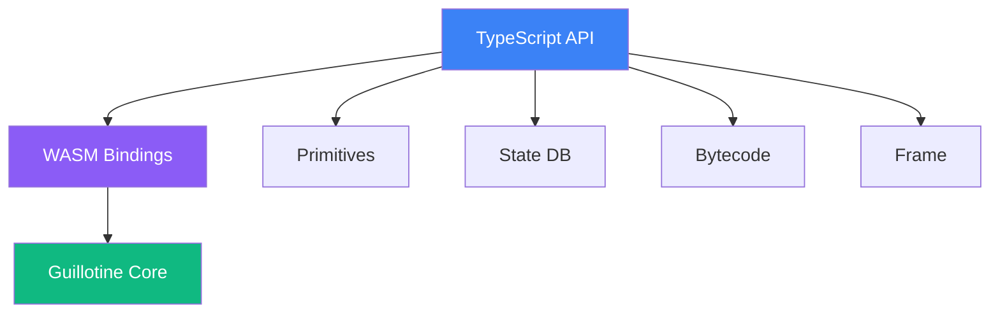

import { Callout } from 'vocs/components'

# TypeScript SDK

High-performance Ethereum Virtual Machine (EVM) implementation for TypeScript/JavaScript, powered by WebAssembly.

<Callout type="warning">
**Experimental/PoC**: This SDK is a vibecoded proof-of-concept. APIs are unstable and may change. We're looking for early users to try it and tell us what APIs you want.

- **Maturity**: Experimental proof-of-concept
- **API stability**: Unstable; breaking changes expected
- **Feedback**: [GitHub Issues](https://github.com/evmts/Guillotine/issues) or [Telegram](https://t.me/+ANThR9bHDLAwMjUx)
</Callout>

## Features

- 🚀 **High Performance**: WebAssembly-compiled Zig implementation
- 🔒 **Type Safe**: Full TypeScript support with strict typing
- 🧩 **Modular**: Separate modules for different EVM components
- 🔄 **Async First**: Non-blocking operations with Promise-based API
- 🧪 **Well Tested**: Comprehensive test suite with real EVM execution
- 📦 **Zero Dependencies**: Only runtime dependency is the WASM module
- 🌐 **Universal**: Works in Node.js, Bun, and browsers

## Installation

::::steps
### Install from npm

```bash
npm install @evmts/guillotine
# or
yarn add @evmts/guillotine
# or
bun add @evmts/guillotine
```

### Or build from source

```bash
git clone https://github.com/evmts/Guillotine.git
cd Guillotine/sdks/ts

# Install dependencies
bun install

# Build TypeScript
bun run build
```
::::

## Quick Start

### Basic Example

```typescript filename="example.ts" showLineNumbers
import { EVM, Address, U256, Bytes } from '@evmts/guillotine';

// Create an EVM instance
const evm = await EVM.create();

// Execute bytecode
const result = await evm.execute({
  bytecode: Bytes.from('0x6001600201'), // PUSH1 1, PUSH1 2, ADD
  gasLimit: 100000n,
  caller: Address.from('0x1234567890123456789012345678901234567890'),
  value: U256.zero()
});

if (result.success) {
  console.log('Gas used:', result.gasUsed);
  console.log('Return data:', result.output.toHex());
} else {
  console.log('Execution failed:', result.error);
}

// Clean up
evm.destroy();
```

### State Management

```typescript filename="state.ts"
// Set account balance
await evm.stateDB.setBalance(
  Address.from('0x742d35Cc6634C0532925a3b844Bc9e7595f7BBDc'),
  U256.from('1000000000000000000') // 1 ETH
);

// Deploy contract code
await evm.stateDB.setCode(contractAddress, contractBytecode);

// Set storage values
await evm.stateDB.setStorage(contractAddress, slot, value);

// Get account info
const balance = await evm.stateDB.getBalance(address);
const nonce = await evm.stateDB.getNonce(address);
const code = await evm.stateDB.getCode(address);
```

## API Reference

### EVM Class

The main entry point for executing EVM bytecode.

:::code-group

```typescript [Initialization]
import { EVM } from '@evmts/guillotine';

// Basic creation
const evm = await EVM.create();

// With configuration
const evm = await EVM.create({
  hardfork: 'shanghai',  // Specify hardfork rules
  enableTracing: false,  // Enable execution tracing
  maxCallDepth: 1024,    // Custom call depth
});
```

```typescript [Transaction Execution]
const result = await evm.execute({
  // Transaction parameters
  caller: Address.from('0x...'),
  to: Address.from('0x...'),
  value: U256.from('1000000000000000000'),
  input: Bytes.from('0x...'),
  gasLimit: 100000n,
  gasPrice: U256.from('20000000000'),
  
  // Block context
  blockNumber: 1000000n,
  timestamp: Date.now() / 1000,
  coinbase: Address.from('0x...'),
  difficulty: U256.zero(),
  gasLimit: 30000000n,
  baseFee: U256.from('10000000000')
});
```

```typescript [Low-Level Frame API]
const frame = await Frame.create({
  bytecode: Bytes.from('0x...'),
  gasLimit: 100000n
});

// Enable step-by-step execution
frame.enableStepping();

while (!frame.isStopped()) {
  const step = await frame.step();
  console.log(`PC: ${step.pc}, Opcode: ${step.opcode}, Gas: ${step.gasRemaining}`);
}

frame.destroy();
```

:::

### Primitive Types

#### Address
20-byte Ethereum address.

```typescript
class Address {
  static from(hex: string): Address;
  static zero(): Address;
  toString(): string;
  toBytes(): Uint8Array;
  isZero(): boolean;
  equals(other: Address): boolean;
}
```

#### U256
256-bit unsigned integer.

```typescript
class U256 {
  static from(value: string | number | bigint): U256;
  static zero(): U256;
  static max(): U256;
  add(other: U256): U256;
  sub(other: U256): U256;
  mul(other: U256): U256;
  div(other: U256): U256;
  toBigInt(): bigint;
  toHex(): string;
}
```

#### Bytes
Variable-length byte array.

```typescript
class Bytes {
  static from(data: string | Uint8Array): Bytes;
  static empty(): Bytes;
  toHex(): string;
  toUint8Array(): Uint8Array;
  slice(start: number, end?: number): Bytes;
  concat(other: Bytes): Bytes;
  length: number;
}
```

## Advanced Usage

### Deploy and Call Contract

```typescript filename="deploy.ts"
// Deploy a simple storage contract
const deployCode = Bytes.from('0x608060405234801561001057600080fd5b50610150806100206000396000f3fe...');

const deployResult = await evm.execute({
  caller: Address.from('0x1234567890123456789012345678901234567890'),
  input: deployCode,
  gasLimit: 1000000n
});

const contractAddress = deployResult.createdAddress;

// Call the deployed contract
const calldata = Bytes.from('0x6057361d0000000000000000000000000000000000000000000000000000000000000042');

const callResult = await evm.execute({
  caller: Address.from('0x1234567890123456789012345678901234567890'),
  to: contractAddress,
  input: calldata,
  gasLimit: 100000n
});

if (callResult.success) {
  console.log('Contract call successful');
  console.log('Return data:', callResult.output.toHex());
}
```

### Custom Tracer

```typescript filename="tracer.ts"
class GasTracer {
  private gasPerOpcode = new Map<string, bigint>();
  
  async onStep(step: TraceStep): Promise<void> {
    const current = this.gasPerOpcode.get(step.opcode) || 0n;
    this.gasPerOpcode.set(step.opcode, current + step.gasCost);
  }
  
  report() {
    console.log('Gas usage by opcode:');
    for (const [opcode, gas] of this.gasPerOpcode) {
      console.log(`  ${opcode}: ${gas}`);
    }
  }
}

const tracer = new GasTracer();
const evm = await EVM.create({ tracer });

// Execute transaction...
await evm.execute({...});

tracer.report();
```

### Working with ABI

```typescript filename="abi.ts"
import { encodeAbiParameters, decodeAbiParameters } from 'viem';

// Encode function call
const functionSig = '0xa9059cbb'; // transfer(address,uint256)
const encoded = encodeAbiParameters(
  [
    { name: 'to', type: 'address' },
    { name: 'amount', type: 'uint256' }
  ],
  ['0x742d35Cc6634C0532925a3b844Bc9e7595f7BBDc', 1000000000000000000n]
);

const calldata = Bytes.from(functionSig + encoded.slice(2));

// Execute call
const result = await evm.execute({
  caller: sender,
  to: tokenContract,
  input: calldata,
  gasLimit: 100000n
});

// Decode return value
if (result.success) {
  const [success] = decodeAbiParameters(
    [{ type: 'bool' }],
    result.output.toHex()
  );
  console.log('Transfer successful:', success);
}
```

### Browser Usage

```html filename="index.html"
<!DOCTYPE html>
<html>
<head>
  <script type="module">
    import { EVM, Address, U256, Bytes } from 'https://unpkg.com/@evmts/guillotine';
    
    async function runEVM() {
      const evm = await EVM.create();
      
      // PUSH1 42
      const bytecode = Bytes.from('0x602a');
      
      const result = await evm.execute({
        bytecode,
        gasLimit: 100000n,
        caller: Address.zero(),
        value: U256.zero()
      });
      
      console.log('Result:', result);
      evm.destroy();
    }
    
    runEVM();
  </script>
</head>
<body>
  <h1>Guillotine EVM in Browser</h1>
  <p>Check console for output</p>
</body>
</html>
```

## Module Architecture



### Main Modules

| Module | Description |
|--------|-------------|
| **EVM** | Main execution engine |
| **Frame** | Low-level execution context |
| **Stack** | EVM stack operations |
| **Memory** | EVM memory management |
| **StateDB** | Blockchain state management |
| **Bytecode** | Bytecode analysis and optimization |

## Performance

Guillotine achieves high performance through:

- **WebAssembly**: Core EVM implementation compiled from Zig to WASM
- **Zero-copy operations**: Minimal data copying between JS and WASM
- **Optimized bytecode**: Advanced bytecode analysis and optimization
- **Memory pooling**: Efficient memory management in WASM

Benchmarks show 2-10x performance improvements over pure JavaScript implementations.

## Testing

### Test Example

```typescript filename="evm.test.ts"
import { describe, it, expect } from 'bun:test';
import { EVM, Address, Bytes, U256 } from '@evmts/guillotine';

describe('EVM', () => {
  it('should execute simple addition', async () => {
    const evm = await EVM.create();
    
    // PUSH1 5, PUSH1 10, ADD
    const bytecode = Bytes.from('0x6005600a01');
    
    const result = await evm.execute({
      bytecode,
      gasLimit: 100000n,
      caller: Address.zero(),
      value: U256.zero()
    });
    
    expect(result.success).toBe(true);
    expect(result.gasUsed).toBeGreaterThan(0n);
    
    evm.destroy();
  });
  
  it('should handle address creation', () => {
    const addr = Address.from('0x742d35Cc6634C0532925a3b844Bc9e7595f7BBDc');
    expect(addr.toString()).toBe('0x742d35cc6634c0532925a3b844bc9e7595f7bbdc');
    expect(addr.isZero()).toBe(false);
  });
});
```

### Running Tests

```bash
# Run all tests
bun test

# Run specific test file
bun test src/primitives/address.test.ts

# Run with coverage
bun test --coverage

# Watch mode
bun test --watch
```

## Development

::::steps
### Setup Development Environment

```bash
# Clone repository
git clone https://github.com/evmts/Guillotine.git
cd Guillotine/sdks/ts

# Install dependencies
bun install
```

### Build Project

```bash
# Build TypeScript
bun run build

# Build WASM module
bun run build:wasm

# Build everything
bun run build:all
```

### Run Development Server

```bash
# Start dev server with hot reload
bun run dev

# Run examples
bun run example
```
::::

## Troubleshooting

:::details[WASM module not found]
**Solution**: Ensure WASM module is built and imported correctly:
```typescript
// For bundlers, you may need to configure WASM loading
import wasmUrl from '@evmts/guillotine/evm.wasm?url';
const evm = await EVM.create({ wasmUrl });
```
:::

:::details[Memory issues with large operations]
**Solution**: Properly manage EVM instances:
```typescript
const evm = await EVM.create();
try {
  // Use EVM
} finally {
  evm.destroy(); // Always clean up
}
```
:::

:::details[TypeScript types not working]
**Solution**: Ensure TypeScript is configured correctly:
```json
// tsconfig.json
{
  "compilerOptions": {
    "moduleResolution": "bundler",
    "types": ["@evmts/guillotine"]
  }
}
```
:::

## Next Steps

<div style={{ display: 'grid', gridTemplateColumns: 'repeat(2, 1fr)', gap: '1rem', marginTop: '2rem' }}>
  <a href="/sdks/bun" style={{
    display: 'block',
    padding: '1.5rem',
    background: 'linear-gradient(135deg, rgba(234, 88, 12, 0.1), rgba(220, 38, 38, 0.05))',
    border: '1px solid rgba(234, 88, 12, 0.3)',
    borderRadius: '12px',
    textDecoration: 'none'
  }}>
    <h3 style={{ margin: '0 0 0.5rem 0' }}>🍞 Bun SDK</h3>
    <p style={{ margin: 0, color: 'var(--vocs-color_text2)' }}>
      Optimized FFI bindings for Bun runtime
    </p>
  </a>
  
  <a href="/sdks/c" style={{
    display: 'block',
    padding: '1.5rem',
    background: 'linear-gradient(135deg, rgba(16, 185, 129, 0.1), rgba(5, 150, 105, 0.05))',
    border: '1px solid rgba(16, 185, 129, 0.3)',
    borderRadius: '12px',
    textDecoration: 'none'
  }}>
    <h3 style={{ margin: '0 0 0.5rem 0' }}>🔧 C SDK</h3>
    <p style={{ margin: 0, color: 'var(--vocs-color_text2)' }}>
      Low-level C API for embedded systems
    </p>
  </a>
</div>

## Support

<Callout type="info">
  **Need help?**
  - 📖 Browse [examples](https://github.com/evmts/Guillotine/tree/main/sdks/ts/examples)
  - 💬 Join our [Telegram community](https://t.me/+ANThR9bHDLAwMjUx)
  - 🐛 Report [issues on GitHub](https://github.com/evmts/Guillotine/issues)
</Callout>